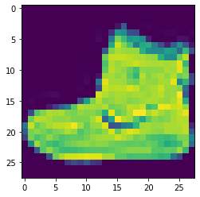
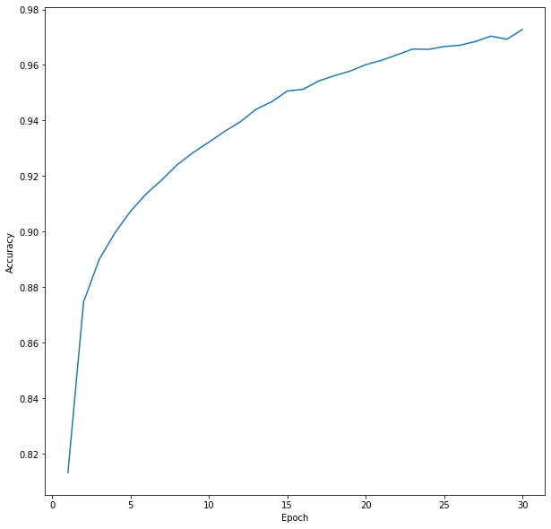

# Convolutional Neural Networks

**Today we learn about how to build Neural Networks using tensorflow and keras. [Tensorflow](https://www.tensorflow.org/overview/) is a lower level Neural Network API, while [Keras](https://keras.io/) is a higher level abstraction, making it ever so simple to create Neural Networks.**


```python
import tensorflow as tf
import matplotlib.pyplot as plt
import numpy as np
```

**We will use the [fashion MNIST](https://github.com/zalandoresearch/fashion-mnist) dataset today>**


```python
fashion_mnist = tf.keras.datasets.fashion_mnist
(X_train, y_train), (X_test, y_test) = fashion_mnist.load_data()
```

**As we can see, a sample contains a 28*28 greyscale image of a piece of clothes>**


```python
X_train[0]
```


    array([[  0,   0,   0,   0,   0,   0,   0,   0,   0,   0,   0,   0,   0,
              0,   0,   0,   0,   0,   0,   0,   0,   0,   0,   0,   0,   0,
              0,   0],
           [  0,   0,   0,   0,   0,   0,   0,   0,   0,   0,   0,   0,   0,
              0,   0,   0,   0,   0,   0,   0,   0,   0,   0,   0,   0,   0,
              0,   0],
           [  0,   0,   0,   0,   0,   0,   0,   0,   0,   0,   0,   0,   0,
              0,   0,   0,   0,   0,   0,   0,   0,   0,   0,   0,   0,   0,
              0,   0],
           [  0,   0,   0,   0,   0,   0,   0,   0,   0,   0,   0,   0,   1,
              0,   0,  13,  73,   0,   0,   1,   4,   0,   0,   0,   0,   1,
              1,   0],
           [  0,   0,   0,   0,   0,   0,   0,   0,   0,   0,   0,   0,   3,
              0,  36, 136, 127,  62,  54,   0,   0,   0,   1,   3,   4,   0,
              0,   3],
           [  0,   0,   0,   0,   0,   0,   0,   0,   0,   0,   0,   0,   6,
              0, 102, 204, 176, 134, 144, 123,  23,   0,   0,   0,   0,  12,
             10,   0],
           [  0,   0,   0,   0,   0,   0,   0,   0,   0,   0,   0,   0,   0,
              0, 155, 236, 207, 178, 107, 156, 161, 109,  64,  23,  77, 130,
             72,  15],
           [  0,   0,   0,   0,   0,   0,   0,   0,   0,   0,   0,   1,   0,
             69, 207, 223, 218, 216, 216, 163, 127, 121, 122, 146, 141,  88,
            172,  66],
           [  0,   0,   0,   0,   0,   0,   0,   0,   0,   1,   1,   1,   0,
            200, 232, 232, 233, 229, 223, 223, 215, 213, 164, 127, 123, 196,
            229,   0],
           [  0,   0,   0,   0,   0,   0,   0,   0,   0,   0,   0,   0,   0,
            183, 225, 216, 223, 228, 235, 227, 224, 222, 224, 221, 223, 245,
            173,   0],
           [  0,   0,   0,   0,   0,   0,   0,   0,   0,   0,   0,   0,   0,
            193, 228, 218, 213, 198, 180, 212, 210, 211, 213, 223, 220, 243,
            202,   0],
           [  0,   0,   0,   0,   0,   0,   0,   0,   0,   1,   3,   0,  12,
            219, 220, 212, 218, 192, 169, 227, 208, 218, 224, 212, 226, 197,
            209,  52],
           [  0,   0,   0,   0,   0,   0,   0,   0,   0,   0,   6,   0,  99,
            244, 222, 220, 218, 203, 198, 221, 215, 213, 222, 220, 245, 119,
            167,  56],
           [  0,   0,   0,   0,   0,   0,   0,   0,   0,   4,   0,   0,  55,
            236, 228, 230, 228, 240, 232, 213, 218, 223, 234, 217, 217, 209,
             92,   0],
           [  0,   0,   1,   4,   6,   7,   2,   0,   0,   0,   0,   0, 237,
            226, 217, 223, 222, 219, 222, 221, 216, 223, 229, 215, 218, 255,
             77,   0],
           [  0,   3,   0,   0,   0,   0,   0,   0,   0,  62, 145, 204, 228,
            207, 213, 221, 218, 208, 211, 218, 224, 223, 219, 215, 224, 244,
            159,   0],
           [  0,   0,   0,   0,  18,  44,  82, 107, 189, 228, 220, 222, 217,
            226, 200, 205, 211, 230, 224, 234, 176, 188, 250, 248, 233, 238,
            215,   0],
           [  0,  57, 187, 208, 224, 221, 224, 208, 204, 214, 208, 209, 200,
            159, 245, 193, 206, 223, 255, 255, 221, 234, 221, 211, 220, 232,
            246,   0],
           [  3, 202, 228, 224, 221, 211, 211, 214, 205, 205, 205, 220, 240,
             80, 150, 255, 229, 221, 188, 154, 191, 210, 204, 209, 222, 228,
            225,   0],
           [ 98, 233, 198, 210, 222, 229, 229, 234, 249, 220, 194, 215, 217,
            241,  65,  73, 106, 117, 168, 219, 221, 215, 217, 223, 223, 224,
            229,  29],
           [ 75, 204, 212, 204, 193, 205, 211, 225, 216, 185, 197, 206, 198,
            213, 240, 195, 227, 245, 239, 223, 218, 212, 209, 222, 220, 221,
            230,  67],
           [ 48, 203, 183, 194, 213, 197, 185, 190, 194, 192, 202, 214, 219,
            221, 220, 236, 225, 216, 199, 206, 186, 181, 177, 172, 181, 205,
            206, 115],
           [  0, 122, 219, 193, 179, 171, 183, 196, 204, 210, 213, 207, 211,
            210, 200, 196, 194, 191, 195, 191, 198, 192, 176, 156, 167, 177,
            210,  92],
           [  0,   0,  74, 189, 212, 191, 175, 172, 175, 181, 185, 188, 189,
            188, 193, 198, 204, 209, 210, 210, 211, 188, 188, 194, 192, 216,
            170,   0],
           [  2,   0,   0,   0,  66, 200, 222, 237, 239, 242, 246, 243, 244,
            221, 220, 193, 191, 179, 182, 182, 181, 176, 166, 168,  99,  58,
              0,   0],
           [  0,   0,   0,   0,   0,   0,   0,  40,  61,  44,  72,  41,  35,
              0,   0,   0,   0,   0,   0,   0,   0,   0,   0,   0,   0,   0,
              0,   0],
           [  0,   0,   0,   0,   0,   0,   0,   0,   0,   0,   0,   0,   0,
              0,   0,   0,   0,   0,   0,   0,   0,   0,   0,   0,   0,   0,
              0,   0],
           [  0,   0,   0,   0,   0,   0,   0,   0,   0,   0,   0,   0,   0,
              0,   0,   0,   0,   0,   0,   0,   0,   0,   0,   0,   0,   0,
              0,   0]], dtype=uint8)


```python
X_train[0].shape
```


    (28, 28)


```python
plt.imshow(X_train[0])
```


    <matplotlib.image.AxesImage at 0x256a48c81d0>





**Tensorflow requires us to reshape the dataset so that each value is in it's own array. We will also normalize the values so we achieve faster convergence>**


```python
X_train = X_train.reshape(60000, 28, 28, 1)
X_test = X_test.reshape(10000, 28, 28, 1)
X_train, X_test = X_train / 255.0, X_test / 255.0
X_train[0]
```


    array([[[0.        ],
            [0.        ],
            [0.        ],
            [0.        ],
            [0.        ],
            [0.        ],
            [0.        ],
            [0.        ],
            [0.        ],
            [0.        ],
            [0.        ],
            [0.        ],
            [0.        ],
            [0.        ],
            [0.        ],
            [0.        ],
            [0.        ],
            [0.        ],
            [0.        ],
            [0.        ],
            [0.        ],
            [0.        ],
            [0.        ],
            [0.        ],
            [0.        ],
            [0.        ],
            [0.        ],
            [0.        ]],
    
           [[0.        ],
            [0.        ],
            [0.        ],
            [0.        ],
            [0.        ],
            [0.        ],
            [0.        ],
            [0.        ],
            [0.        ],
            [0.        ],
            [0.        ],
            [0.        ],
            [0.        ],
            [0.        ],
            [0.        ],
            [0.        ],
            [0.        ],
            [0.        ],
            [0.        ],
            [0.        ],
            [0.        ],
            [0.        ],
            [0.        ],
            [0.        ],
            [0.        ],
            [0.        ],
            [0.        ],
            [0.        ]],
    
           [[0.        ],
            [0.        ],
            [0.        ],
            [0.        ],
            [0.        ],
            [0.        ],
            [0.        ],
            [0.        ],
            [0.        ],
            [0.        ],
            [0.        ],
            [0.        ],
            [0.        ],
            [0.        ],
            [0.        ],
            [0.        ],
            [0.        ],
            [0.        ],
            [0.        ],
            [0.        ],
            [0.        ],
            [0.        ],
            [0.        ],
            [0.        ],
            [0.        ],
            [0.        ],
            [0.        ],
            [0.        ]],
    
           [[0.        ],
            [0.        ],
            [0.        ],
            [0.        ],
            [0.        ],
            [0.        ],
            [0.        ],
            [0.        ],
            [0.        ],
            [0.        ],
            [0.        ],
            [0.        ],
            [0.00392157],
            [0.        ],
            [0.        ],
            [0.05098039],
            [0.28627451],
            [0.        ],
            [0.        ],
            [0.00392157],
            [0.01568627],
            [0.        ],
            [0.        ],
            [0.        ],
            [0.        ],
            [0.00392157],
            [0.00392157],
            [0.        ]],
    
           [[0.        ],
            [0.        ],
            [0.        ],
            [0.        ],
            [0.        ],
            [0.        ],
            [0.        ],
            [0.        ],
            [0.        ],
            [0.        ],
            [0.        ],
            [0.        ],
            [0.01176471],
            [0.        ],
            [0.14117647],
            [0.53333333],
            [0.49803922],
            [0.24313725],
            [0.21176471],
            [0.        ],
            [0.        ],
            [0.        ],
            [0.00392157],
            [0.01176471],
            [0.01568627],
            [0.        ],
            [0.        ],
            [0.01176471]],
    
           [[0.        ],
            [0.        ],
            [0.        ],
            [0.        ],
            [0.        ],
            [0.        ],
            [0.        ],
            [0.        ],
            [0.        ],
            [0.        ],
            [0.        ],
            [0.        ],
            [0.02352941],
            [0.        ],
            [0.4       ],
            [0.8       ],
            [0.69019608],
            [0.5254902 ],
            [0.56470588],
            [0.48235294],
            [0.09019608],
            [0.        ],
            [0.        ],
            [0.        ],
            [0.        ],
            [0.04705882],
            [0.03921569],
            [0.        ]],
    
           [[0.        ],
            [0.        ],
            [0.        ],
            [0.        ],
            [0.        ],
            [0.        ],
            [0.        ],
            [0.        ],
            [0.        ],
            [0.        ],
            [0.        ],
            [0.        ],
            [0.        ],
            [0.        ],
            [0.60784314],
            [0.9254902 ],
            [0.81176471],
            [0.69803922],
            [0.41960784],
            [0.61176471],
            [0.63137255],
            [0.42745098],
            [0.25098039],
            [0.09019608],
            [0.30196078],
            [0.50980392],
            [0.28235294],
            [0.05882353]],
    
           [[0.        ],
            [0.        ],
            [0.        ],
            [0.        ],
            [0.        ],
            [0.        ],
            [0.        ],
            [0.        ],
            [0.        ],
            [0.        ],
            [0.        ],
            [0.00392157],
            [0.        ],
            [0.27058824],
            [0.81176471],
            [0.8745098 ],
            [0.85490196],
            [0.84705882],
            [0.84705882],
            [0.63921569],
            [0.49803922],
            [0.4745098 ],
            [0.47843137],
            [0.57254902],
            [0.55294118],
            [0.34509804],
            [0.6745098 ],
            [0.25882353]],
    
           [[0.        ],
            [0.        ],
            [0.        ],
            [0.        ],
            [0.        ],
            [0.        ],
            [0.        ],
            [0.        ],
            [0.        ],
            [0.00392157],
            [0.00392157],
            [0.00392157],
            [0.        ],
            [0.78431373],
            [0.90980392],
            [0.90980392],
            [0.91372549],
            [0.89803922],
            [0.8745098 ],
            [0.8745098 ],
            [0.84313725],
            [0.83529412],
            [0.64313725],
            [0.49803922],
            [0.48235294],
            [0.76862745],
            [0.89803922],
            [0.        ]],
    
           [[0.        ],
            [0.        ],
            [0.        ],
            [0.        ],
            [0.        ],
            [0.        ],
            [0.        ],
            [0.        ],
            [0.        ],
            [0.        ],
            [0.        ],
            [0.        ],
            [0.        ],
            [0.71764706],
            [0.88235294],
            [0.84705882],
            [0.8745098 ],
            [0.89411765],
            [0.92156863],
            [0.89019608],
            [0.87843137],
            [0.87058824],
            [0.87843137],
            [0.86666667],
            [0.8745098 ],
            [0.96078431],
            [0.67843137],
            [0.        ]],
    
           [[0.        ],
            [0.        ],
            [0.        ],
            [0.        ],
            [0.        ],
            [0.        ],
            [0.        ],
            [0.        ],
            [0.        ],
            [0.        ],
            [0.        ],
            [0.        ],
            [0.        ],
            [0.75686275],
            [0.89411765],
            [0.85490196],
            [0.83529412],
            [0.77647059],
            [0.70588235],
            [0.83137255],
            [0.82352941],
            [0.82745098],
            [0.83529412],
            [0.8745098 ],
            [0.8627451 ],
            [0.95294118],
            [0.79215686],
            [0.        ]],
    
           [[0.        ],
            [0.        ],
            [0.        ],
            [0.        ],
            [0.        ],
            [0.        ],
            [0.        ],
            [0.        ],
            [0.        ],
            [0.00392157],
            [0.01176471],
            [0.        ],
            [0.04705882],
            [0.85882353],
            [0.8627451 ],
            [0.83137255],
            [0.85490196],
            [0.75294118],
            [0.6627451 ],
            [0.89019608],
            [0.81568627],
            [0.85490196],
            [0.87843137],
            [0.83137255],
            [0.88627451],
            [0.77254902],
            [0.81960784],
            [0.20392157]],
    
           [[0.        ],
            [0.        ],
            [0.        ],
            [0.        ],
            [0.        ],
            [0.        ],
            [0.        ],
            [0.        ],
            [0.        ],
            [0.        ],
            [0.02352941],
            [0.        ],
            [0.38823529],
            [0.95686275],
            [0.87058824],
            [0.8627451 ],
            [0.85490196],
            [0.79607843],
            [0.77647059],
            [0.86666667],
            [0.84313725],
            [0.83529412],
            [0.87058824],
            [0.8627451 ],
            [0.96078431],
            [0.46666667],
            [0.65490196],
            [0.21960784]],
    
           [[0.        ],
            [0.        ],
            [0.        ],
            [0.        ],
            [0.        ],
            [0.        ],
            [0.        ],
            [0.        ],
            [0.        ],
            [0.01568627],
            [0.        ],
            [0.        ],
            [0.21568627],
            [0.9254902 ],
            [0.89411765],
            [0.90196078],
            [0.89411765],
            [0.94117647],
            [0.90980392],
            [0.83529412],
            [0.85490196],
            [0.8745098 ],
            [0.91764706],
            [0.85098039],
            [0.85098039],
            [0.81960784],
            [0.36078431],
            [0.        ]],
    
           [[0.        ],
            [0.        ],
            [0.00392157],
            [0.01568627],
            [0.02352941],
            [0.02745098],
            [0.00784314],
            [0.        ],
            [0.        ],
            [0.        ],
            [0.        ],
            [0.        ],
            [0.92941176],
            [0.88627451],
            [0.85098039],
            [0.8745098 ],
            [0.87058824],
            [0.85882353],
            [0.87058824],
            [0.86666667],
            [0.84705882],
            [0.8745098 ],
            [0.89803922],
            [0.84313725],
            [0.85490196],
            [1.        ],
            [0.30196078],
            [0.        ]],
    
           [[0.        ],
            [0.01176471],
            [0.        ],
            [0.        ],
            [0.        ],
            [0.        ],
            [0.        ],
            [0.        ],
            [0.        ],
            [0.24313725],
            [0.56862745],
            [0.8       ],
            [0.89411765],
            [0.81176471],
            [0.83529412],
            [0.86666667],
            [0.85490196],
            [0.81568627],
            [0.82745098],
            [0.85490196],
            [0.87843137],
            [0.8745098 ],
            [0.85882353],
            [0.84313725],
            [0.87843137],
            [0.95686275],
            [0.62352941],
            [0.        ]],
    
           [[0.        ],
            [0.        ],
            [0.        ],
            [0.        ],
            [0.07058824],
            [0.17254902],
            [0.32156863],
            [0.41960784],
            [0.74117647],
            [0.89411765],
            [0.8627451 ],
            [0.87058824],
            [0.85098039],
            [0.88627451],
            [0.78431373],
            [0.80392157],
            [0.82745098],
            [0.90196078],
            [0.87843137],
            [0.91764706],
            [0.69019608],
            [0.7372549 ],
            [0.98039216],
            [0.97254902],
            [0.91372549],
            [0.93333333],
            [0.84313725],
            [0.        ]],
    
           [[0.        ],
            [0.22352941],
            [0.73333333],
            [0.81568627],
            [0.87843137],
            [0.86666667],
            [0.87843137],
            [0.81568627],
            [0.8       ],
            [0.83921569],
            [0.81568627],
            [0.81960784],
            [0.78431373],
            [0.62352941],
            [0.96078431],
            [0.75686275],
            [0.80784314],
            [0.8745098 ],
            [1.        ],
            [1.        ],
            [0.86666667],
            [0.91764706],
            [0.86666667],
            [0.82745098],
            [0.8627451 ],
            [0.90980392],
            [0.96470588],
            [0.        ]],
    
           [[0.01176471],
            [0.79215686],
            [0.89411765],
            [0.87843137],
            [0.86666667],
            [0.82745098],
            [0.82745098],
            [0.83921569],
            [0.80392157],
            [0.80392157],
            [0.80392157],
            [0.8627451 ],
            [0.94117647],
            [0.31372549],
            [0.58823529],
            [1.        ],
            [0.89803922],
            [0.86666667],
            [0.7372549 ],
            [0.60392157],
            [0.74901961],
            [0.82352941],
            [0.8       ],
            [0.81960784],
            [0.87058824],
            [0.89411765],
            [0.88235294],
            [0.        ]],
    
           [[0.38431373],
            [0.91372549],
            [0.77647059],
            [0.82352941],
            [0.87058824],
            [0.89803922],
            [0.89803922],
            [0.91764706],
            [0.97647059],
            [0.8627451 ],
            [0.76078431],
            [0.84313725],
            [0.85098039],
            [0.94509804],
            [0.25490196],
            [0.28627451],
            [0.41568627],
            [0.45882353],
            [0.65882353],
            [0.85882353],
            [0.86666667],
            [0.84313725],
            [0.85098039],
            [0.8745098 ],
            [0.8745098 ],
            [0.87843137],
            [0.89803922],
            [0.11372549]],
    
           [[0.29411765],
            [0.8       ],
            [0.83137255],
            [0.8       ],
            [0.75686275],
            [0.80392157],
            [0.82745098],
            [0.88235294],
            [0.84705882],
            [0.7254902 ],
            [0.77254902],
            [0.80784314],
            [0.77647059],
            [0.83529412],
            [0.94117647],
            [0.76470588],
            [0.89019608],
            [0.96078431],
            [0.9372549 ],
            [0.8745098 ],
            [0.85490196],
            [0.83137255],
            [0.81960784],
            [0.87058824],
            [0.8627451 ],
            [0.86666667],
            [0.90196078],
            [0.2627451 ]],
    
           [[0.18823529],
            [0.79607843],
            [0.71764706],
            [0.76078431],
            [0.83529412],
            [0.77254902],
            [0.7254902 ],
            [0.74509804],
            [0.76078431],
            [0.75294118],
            [0.79215686],
            [0.83921569],
            [0.85882353],
            [0.86666667],
            [0.8627451 ],
            [0.9254902 ],
            [0.88235294],
            [0.84705882],
            [0.78039216],
            [0.80784314],
            [0.72941176],
            [0.70980392],
            [0.69411765],
            [0.6745098 ],
            [0.70980392],
            [0.80392157],
            [0.80784314],
            [0.45098039]],
    
           [[0.        ],
            [0.47843137],
            [0.85882353],
            [0.75686275],
            [0.70196078],
            [0.67058824],
            [0.71764706],
            [0.76862745],
            [0.8       ],
            [0.82352941],
            [0.83529412],
            [0.81176471],
            [0.82745098],
            [0.82352941],
            [0.78431373],
            [0.76862745],
            [0.76078431],
            [0.74901961],
            [0.76470588],
            [0.74901961],
            [0.77647059],
            [0.75294118],
            [0.69019608],
            [0.61176471],
            [0.65490196],
            [0.69411765],
            [0.82352941],
            [0.36078431]],
    
           [[0.        ],
            [0.        ],
            [0.29019608],
            [0.74117647],
            [0.83137255],
            [0.74901961],
            [0.68627451],
            [0.6745098 ],
            [0.68627451],
            [0.70980392],
            [0.7254902 ],
            [0.7372549 ],
            [0.74117647],
            [0.7372549 ],
            [0.75686275],
            [0.77647059],
            [0.8       ],
            [0.81960784],
            [0.82352941],
            [0.82352941],
            [0.82745098],
            [0.7372549 ],
            [0.7372549 ],
            [0.76078431],
            [0.75294118],
            [0.84705882],
            [0.66666667],
            [0.        ]],
    
           [[0.00784314],
            [0.        ],
            [0.        ],
            [0.        ],
            [0.25882353],
            [0.78431373],
            [0.87058824],
            [0.92941176],
            [0.9372549 ],
            [0.94901961],
            [0.96470588],
            [0.95294118],
            [0.95686275],
            [0.86666667],
            [0.8627451 ],
            [0.75686275],
            [0.74901961],
            [0.70196078],
            [0.71372549],
            [0.71372549],
            [0.70980392],
            [0.69019608],
            [0.65098039],
            [0.65882353],
            [0.38823529],
            [0.22745098],
            [0.        ],
            [0.        ]],
    
           [[0.        ],
            [0.        ],
            [0.        ],
            [0.        ],
            [0.        ],
            [0.        ],
            [0.        ],
            [0.15686275],
            [0.23921569],
            [0.17254902],
            [0.28235294],
            [0.16078431],
            [0.1372549 ],
            [0.        ],
            [0.        ],
            [0.        ],
            [0.        ],
            [0.        ],
            [0.        ],
            [0.        ],
            [0.        ],
            [0.        ],
            [0.        ],
            [0.        ],
            [0.        ],
            [0.        ],
            [0.        ],
            [0.        ]],
    
           [[0.        ],
            [0.        ],
            [0.        ],
            [0.        ],
            [0.        ],
            [0.        ],
            [0.        ],
            [0.        ],
            [0.        ],
            [0.        ],
            [0.        ],
            [0.        ],
            [0.        ],
            [0.        ],
            [0.        ],
            [0.        ],
            [0.        ],
            [0.        ],
            [0.        ],
            [0.        ],
            [0.        ],
            [0.        ],
            [0.        ],
            [0.        ],
            [0.        ],
            [0.        ],
            [0.        ],
            [0.        ]],
    
           [[0.        ],
            [0.        ],
            [0.        ],
            [0.        ],
            [0.        ],
            [0.        ],
            [0.        ],
            [0.        ],
            [0.        ],
            [0.        ],
            [0.        ],
            [0.        ],
            [0.        ],
            [0.        ],
            [0.        ],
            [0.        ],
            [0.        ],
            [0.        ],
            [0.        ],
            [0.        ],
            [0.        ],
            [0.        ],
            [0.        ],
            [0.        ],
            [0.        ],
            [0.        ],
            [0.        ],
            [0.        ]]])


**Creating a network is easy. We just have to define the architecture by defining the layers in sequence. The most important parameters are the input shape at the first layer, and the output size at the Dense layer. The size of interim layers are calculated by Keras using the filter sizes>**


```python
model1 = tf.keras.models.Sequential([
    tf.keras.layers.Conv2D(16, (3, 3), input_shape=(28, 28, 1), activation='relu'),
    tf.keras.layers.MaxPooling2D(2, 2),
    tf.keras.layers.Conv2D(32, (3, 3), activation='relu'),
    tf.keras.layers.MaxPooling2D(2, 2),
    tf.keras.layers.Flatten(),
    tf.keras.layers.Dense(128, activation='relu'),
    tf.keras.layers.Dense(10, activation='softmax')
]
)

model1.compile(optimizer='SGD', loss='sparse_categorical_crossentropy', metrics=['accuracy'])

model1.fit(X_train, y_train, epochs=30)
```

    Epoch 1/30
    60000/60000 [==============================] - 9s 143us/sample - loss: 0.8505 - acc: 0.6891
    Epoch 2/30
    60000/60000 [==============================] - 10s 163us/sample - loss: 0.5387 - acc: 0.8012
    Epoch 3/30
    60000/60000 [==============================] - 10s 160us/sample - loss: 0.4708 - acc: 0.8277
    Epoch 4/30
    60000/60000 [==============================] - 10s 161us/sample - loss: 0.4310 - acc: 0.8452
    Epoch 5/30
    60000/60000 [==============================] - 9s 155us/sample - loss: 0.4033 - acc: 0.8539
    Epoch 6/30
    60000/60000 [==============================] - 10s 165us/sample - loss: 0.3811 - acc: 0.8620
    Epoch 7/30
    60000/60000 [==============================] - 9s 158us/sample - loss: 0.3638 - acc: 0.8684
    Epoch 8/30
    60000/60000 [==============================] - 10s 164us/sample - loss: 0.3512 - acc: 0.8735
    Epoch 9/30
    60000/60000 [==============================] - 10s 159us/sample - loss: 0.3390 - acc: 0.8776
    Epoch 10/30
    60000/60000 [==============================] - 10s 159us/sample - loss: 0.3284 - acc: 0.8808
    Epoch 11/30
    60000/60000 [==============================] - 8s 140us/sample - loss: 0.3189 - acc: 0.8848
    Epoch 12/30
    60000/60000 [==============================] - 8s 131us/sample - loss: 0.3100 - acc: 0.8874
    Epoch 13/30
    60000/60000 [==============================] - 9s 145us/sample - loss: 0.3028 - acc: 0.8893
    Epoch 14/30
    60000/60000 [==============================] - 8s 139us/sample - loss: 0.2969 - acc: 0.8914
    Epoch 15/30
    60000/60000 [==============================] - 9s 147us/sample - loss: 0.2900 - acc: 0.8947
    Epoch 16/30
    60000/60000 [==============================] - 10s 170us/sample - loss: 0.2840 - acc: 0.8967
    Epoch 17/30
    60000/60000 [==============================] - 9s 157us/sample - loss: 0.2769 - acc: 0.8988
    Epoch 18/30
    60000/60000 [==============================] - 9s 156us/sample - loss: 0.2711 - acc: 0.9013
    Epoch 19/30
    60000/60000 [==============================] - 10s 164us/sample - loss: 0.2661 - acc: 0.9019
    Epoch 20/30
    60000/60000 [==============================] - 11s 177us/sample - loss: 0.2608 - acc: 0.9043 - loss: 0.2610 - acc: 0.90
    Epoch 21/30
    60000/60000 [==============================] - 10s 171us/sample - loss: 0.2554 - acc: 0.9064
    Epoch 22/30
    60000/60000 [==============================] - 9s 150us/sample - loss: 0.2511 - acc: 0.9081
    Epoch 23/30
    60000/60000 [==============================] - 9s 153us/sample - loss: 0.2467 - acc: 0.9079
    Epoch 24/30
    60000/60000 [==============================] - 10s 161us/sample - loss: 0.2422 - acc: 0.9108
    Epoch 25/30
    60000/60000 [==============================] - 8s 132us/sample - loss: 0.2374 - acc: 0.9131
    Epoch 26/30
    60000/60000 [==============================] - 8s 131us/sample - loss: 0.2338 - acc: 0.9140
    Epoch 27/30
    60000/60000 [==============================] - 8s 139us/sample - loss: 0.2300 - acc: 0.9152
    Epoch 28/30
    60000/60000 [==============================] - 9s 156us/sample - loss: 0.2266 - acc: 0.9171
    Epoch 29/30
    60000/60000 [==============================] - 10s 166us/sample - loss: 0.2217 - acc: 0.9186
    Epoch 30/30
    60000/60000 [==============================] - 10s 165us/sample - loss: 0.2187 - acc: 0.9183
    


    <tensorflow.python.keras.callbacks.History at 0x256e60384e0>


**We can see the generated modell using the `summary` method of the model>**


```python
model1.summary()
```

    _________________________________________________________________
    Layer (type)                 Output Shape              Param #   
    =================================================================
    conv2d_4 (Conv2D)            (None, 26, 26, 16)        160       
    _________________________________________________________________
    max_pooling2d_4 (MaxPooling2 (None, 13, 13, 16)        0         
    _________________________________________________________________
    conv2d_5 (Conv2D)            (None, 11, 11, 32)        4640      
    _________________________________________________________________
    max_pooling2d_5 (MaxPooling2 (None, 5, 5, 32)          0         
    _________________________________________________________________
    flatten_2 (Flatten)          (None, 800)               0         
    _________________________________________________________________
    dense_4 (Dense)              (None, 128)               102528    
    _________________________________________________________________
    dense_5 (Dense)              (None, 10)                1290      
    =================================================================
    Total params: 108,618
    Trainable params: 108,618
    Non-trainable params: 0
    _________________________________________________________________
    

**Now we test the model to see how accurate it is>**


```python
loss, accuracy = model1.evaluate(X_test, y_test)
print(f'Test Accuracy of model1: |{accuracy}|, Test loss: |{loss}|')
```

    10000/10000 [==============================] - 1s 101us/sample - loss: 0.3014 - acc: 0.8943
    Test Accuracy of model1: |0.8942999839782715|, Test loss: |0.3014182622551918|
    

**We can also visualize the training of our model to see how it converges. To do that we need to pass a callback class to the `fit` method that will get called after each epoch to store the current accuracy and loss. We also add a Dropout layer to prevent possible overfitting>**


```python
class AccuracyHistory(tf.keras.callbacks.Callback):
    def on_train_begin(self, logs={}):
        self.acc = []

    def on_epoch_end(self, batch, logs={}):
        print(logs)
        print(batch)
        self.acc.append(logs.get('acc'))
        
history = AccuracyHistory()
```


```python
model2 = tf.keras.models.Sequential([
    tf.keras.layers.Conv2D(16, (5, 5), input_shape=(28, 28, 1), activation='relu'),
    tf.keras.layers.Dropout(.25),
    tf.keras.layers.MaxPooling2D(2, 2),
    tf.keras.layers.Conv2D(32, (4, 4), activation='relu'),
    tf.keras.layers.MaxPooling2D(2, 2),
    tf.keras.layers.Flatten(),
    tf.keras.layers.Dense(128, activation='relu'),
    tf.keras.layers.Dense(10, activation='softmax')
]
)

model2.compile(optimizer='SGD', loss='sparse_categorical_crossentropy', metrics=['accuracy'])

model2.fit(X_train, y_train, epochs=30, callbacks = [history])
```

    WARNING:tensorflow:From C:\tools\Anaconda3\envs\ds\lib\site-packages\tensorflow\python\keras\layers\core.py:143: calling dropout (from tensorflow.python.ops.nn_ops) with keep_prob is deprecated and will be removed in a future version.
    Instructions for updating:
    Please use `rate` instead of `keep_prob`. Rate should be set to `rate = 1 - keep_prob`.
    Epoch 1/30
    59872/60000 [============================>.] - ETA: 0s - loss: 0.8255 - acc: 0.7042{'loss': 0.8249441483020783, 'acc': 0.7043833}
    0
    60000/60000 [==============================] - 12s 193us/sample - loss: 0.8249 - acc: 0.7044
    Epoch 2/30
    59744/60000 [============================>.] - ETA: 0s - loss: 0.5402 - acc: 0.8004{'loss': 0.5398676585117976, 'acc': 0.80046666}
    1
    60000/60000 [==============================] - 11s 189us/sample - loss: 0.5399 - acc: 0.8005
    Epoch 3/30
    59840/60000 [============================>.] - ETA: 0s - loss: 0.4720 - acc: 0.8269{'loss': 0.471922259970506, 'acc': 0.82703334}
    2
    60000/60000 [==============================] - 11s 190us/sample - loss: 0.4719 - acc: 0.8270
    Epoch 4/30
    59712/60000 [============================>.] - ETA: 0s - loss: 0.4319 - acc: 0.8435{'loss': 0.43198557873566945, 'acc': 0.8434833}
    3
    60000/60000 [==============================] - 10s 174us/sample - loss: 0.4320 - acc: 0.8435
    Epoch 5/30
    59776/60000 [============================>.] - ETA: 0s - loss: 0.4045 - acc: 0.8537{'loss': 0.4044873899181684, 'acc': 0.85373336}
    4
    60000/60000 [==============================] - 10s 163us/sample - loss: 0.4045 - acc: 0.8537
    Epoch 6/30
    59872/60000 [============================>.] - ETA: 0s - loss: 0.3843 - acc: 0.8601{'loss': 0.3841490006009738, 'acc': 0.86016667}
    5
    60000/60000 [==============================] - 10s 171us/sample - loss: 0.3841 - acc: 0.8602
    Epoch 7/30
    59840/60000 [============================>.] - ETA: 0s - loss: 0.3693 - acc: 0.8657{'loss': 0.36896153535048165, 'acc': 0.86585}
    6
    60000/60000 [==============================] - 11s 176us/sample - loss: 0.3690 - acc: 0.8658
    Epoch 8/30
    59968/60000 [============================>.] - ETA: 0s - loss: 0.3558 - acc: 0.8702{'loss': 0.3559045922398567, 'acc': 0.87016666}
    7
    60000/60000 [==============================] - 10s 159us/sample - loss: 0.3559 - acc: 0.8702
    Epoch 9/30
    59840/60000 [============================>.] - ETA: 0s - loss: 0.3450 - acc: 0.8740{'loss': 0.34468819470008216, 'acc': 0.87406665}
    8
    60000/60000 [==============================] - 9s 143us/sample - loss: 0.3447 - acc: 0.8741
    Epoch 10/30
    59712/60000 [============================>.] - ETA: 0s - loss: 0.3348 - acc: 0.8787{'loss': 0.33514445688525835, 'acc': 0.8787}
    9
    60000/60000 [==============================] - 8s 137us/sample - loss: 0.3351 - acc: 0.8787
    Epoch 11/30
    59872/60000 [============================>.] - ETA: 0s - loss: 0.3245 - acc: 0.8811{'loss': 0.3244244412779808, 'acc': 0.88121665}
    10
    60000/60000 [==============================] - 9s 148us/sample - loss: 0.3244 - acc: 0.8812
    Epoch 12/30
    59872/60000 [============================>.] - ETA: 0s - loss: 0.3171 - acc: 0.8843{'loss': 0.3173492686231931, 'acc': 0.88423336}
    11
    60000/60000 [==============================] - 10s 168us/sample - loss: 0.3173 - acc: 0.8842
    Epoch 13/30
    59936/60000 [============================>.] - ETA: 0s - loss: 0.3091 - acc: 0.8864{'loss': 0.30899533285895986, 'acc': 0.8864167}
    12
    60000/60000 [==============================] - 12s 208us/sample - loss: 0.3090 - acc: 0.8864
    Epoch 14/30
    59776/60000 [============================>.] - ETA: 0s - loss: 0.3023 - acc: 0.8895{'loss': 0.3021406896273295, 'acc': 0.8895}
    13
    60000/60000 [==============================] - 11s 183us/sample - loss: 0.3021 - acc: 0.8895
    Epoch 15/30
    59840/60000 [============================>.] - ETA: 0s - loss: 0.2967 - acc: 0.8916{'loss': 0.2966392835299174, 'acc': 0.89171666}
    14
    60000/60000 [==============================] - 11s 183us/sample - loss: 0.2966 - acc: 0.8917
    Epoch 16/30
    59712/60000 [============================>.] - ETA: 0s - loss: 0.2899 - acc: 0.8935{'loss': 0.28977444273233416, 'acc': 0.89353335}
    15
    60000/60000 [==============================] - 11s 179us/sample - loss: 0.2898 - acc: 0.8935
    Epoch 17/30
    59648/60000 [============================>.] - ETA: 0s - loss: 0.2856 - acc: 0.8958{'loss': 0.28609580648144084, 'acc': 0.89563334}
    16
    60000/60000 [==============================] - 11s 179us/sample - loss: 0.2861 - acc: 0.8956
    Epoch 18/30
    59936/60000 [============================>.] - ETA: 0s - loss: 0.2803 - acc: 0.8983{'loss': 0.2803578964918852, 'acc': 0.8982667}
    17
    60000/60000 [==============================] - 12s 197us/sample - loss: 0.2804 - acc: 0.8983
    Epoch 19/30
    59808/60000 [============================>.] - ETA: 0s - loss: 0.2744 - acc: 0.8984{'loss': 0.2744091341674328, 'acc': 0.8983833}
    18
    60000/60000 [==============================] - 11s 181us/sample - loss: 0.2744 - acc: 0.8984
    Epoch 20/30
    59776/60000 [============================>.] - ETA: 0s - loss: 0.2707 - acc: 0.9006{'loss': 0.27070961111187936, 'acc': 0.90063334}
    19
    60000/60000 [==============================] - 10s 168us/sample - loss: 0.2707 - acc: 0.9006
    Epoch 21/30
    59936/60000 [============================>.] - ETA: 0s - loss: 0.2656 - acc: 0.9015{'loss': 0.2655369734466076, 'acc': 0.9015}
    20
    60000/60000 [==============================] - 11s 178us/sample - loss: 0.2655 - acc: 0.9015
    Epoch 22/30
    59648/60000 [============================>.] - ETA: 0s - loss: 0.2613 - acc: 0.9034{'loss': 0.2613243793169657, 'acc': 0.9033833}
    21
    60000/60000 [==============================] - 10s 167us/sample - loss: 0.2613 - acc: 0.9034
    Epoch 23/30
    59936/60000 [============================>.] - ETA: 0s - loss: 0.2586 - acc: 0.9044{'loss': 0.2586680567195018, 'acc': 0.9044}
    22
    60000/60000 [==============================] - 9s 148us/sample - loss: 0.2587 - acc: 0.9044
    Epoch 24/30
    59776/60000 [============================>.] - ETA: 0s - loss: 0.2543 - acc: 0.9055{'loss': 0.25433914665381113, 'acc': 0.9055333}
    23
    60000/60000 [==============================] - 11s 184us/sample - loss: 0.2543 - acc: 0.9055
    Epoch 25/30
    59776/60000 [============================>.] - ETA: 0s - loss: 0.2518 - acc: 0.9075{'loss': 0.2516235290428003, 'acc': 0.90756667}
    24
    60000/60000 [==============================] - 11s 177us/sample - loss: 0.2516 - acc: 0.9076
    Epoch 26/30
    59840/60000 [============================>.] - ETA: 0s - loss: 0.2481 - acc: 0.9085{'loss': 0.2480717741648356, 'acc': 0.9085}
    25
    60000/60000 [==============================] - 11s 175us/sample - loss: 0.2481 - acc: 0.9085
    Epoch 27/30
    59744/60000 [============================>.] - ETA: 0s - loss: 0.2449 - acc: 0.9090{'loss': 0.24503734949032466, 'acc': 0.9089}
    26
    60000/60000 [==============================] - 11s 188us/sample - loss: 0.2450 - acc: 0.9089
    Epoch 28/30
    59936/60000 [============================>.] - ETA: 0s - loss: 0.2405 - acc: 0.9116{'loss': 0.24047178385853768, 'acc': 0.9116}
    27
    60000/60000 [==============================] - 11s 181us/sample - loss: 0.2405 - acc: 0.9116
    Epoch 29/30
    59744/60000 [============================>.] - ETA: 0s - loss: 0.2370 - acc: 0.9128{'loss': 0.23721932191749415, 'acc': 0.9127}
    28
    60000/60000 [==============================] - 10s 172us/sample - loss: 0.2372 - acc: 0.9127
    Epoch 30/30
    59968/60000 [============================>.] - ETA: 0s - loss: 0.2344 - acc: 0.9131{'loss': 0.2345114965478579, 'acc': 0.9131}
    29
    60000/60000 [==============================] - 11s 178us/sample - loss: 0.2345 - acc: 0.9131
    


    <tensorflow.python.keras.callbacks.History at 0x256e660f860>


**As we can see overfitting was not really a problem as our model did not improve>**


```python
loss, accuracy = model2.evaluate(X_test, y_test)
print(f'Test Accuracy of model2: |{accuracy}|, Test loss: |{loss}|')
```

    10000/10000 [==============================] - 1s 124us/sample - loss: 0.3112 - acc: 0.8865
    Test Accuracy of model2: |0.8865000009536743|, Test loss: |0.3111873433113098|
    

**The accuracy history is stored and can be plotted now. The plot shows us that the model is converging nice and steady>**


```python
history.acc
```


    [0.7043833,
     0.80046666,
     0.82703334,
     0.8434833,
     0.85373336,
     0.86016667,
     0.86585,
     0.87016666,
     0.87406665,
     0.8787,
     0.88121665,
     0.88423336,
     0.8864167,
     0.8895,
     0.89171666,
     0.89353335,
     0.89563334,
     0.8982667,
     0.8983833,
     0.90063334,
     0.9015,
     0.9033833,
     0.9044,
     0.9055333,
     0.90756667,
     0.9085,
     0.9089,
     0.9116,
     0.9127,
     0.9131]


```python
plt.figure(figsize = (10,10))


plt.plot(range(1, len(history.acc) + 1), history.acc)
plt.xlabel('Epoch')
plt.ylabel('Accuracy')
```


    Text(0, 0.5, 'Accuracy')


**We can experiment with the network architecture and other hyperparameters such as the optimizer. Neural Networks are hard because we have an infinite number of possible architectures and hyperparameters that we can experiment with>**


```python
history = AccuracyHistory()

model3 = tf.keras.models.Sequential([
    tf.keras.layers.Conv2D(16, (5, 5), input_shape=(28, 28, 1), activation='relu'),
    tf.keras.layers.Dropout(.25),
    tf.keras.layers.MaxPooling2D(2, 2),
    tf.keras.layers.Conv2D(32, (4, 4), activation='relu'),
    tf.keras.layers.MaxPooling2D(2, 2),
    tf.keras.layers.Flatten(),
    tf.keras.layers.Dense(256, activation='relu'),
    tf.keras.layers.Dense(10, activation='softmax')
]
)

model3.compile(optimizer='Adam', loss='sparse_categorical_crossentropy', metrics=['accuracy'])

model3.fit(X_train, y_train, epochs=30, callbacks = [history])
```

    Epoch 1/30
    59840/60000 [============================>.] - ETA: 0s - loss: 0.5105 - acc: 0.8132{'loss': 0.5105879448831081, 'acc': 0.8131667}
    0
    60000/60000 [==============================] - 12s 208us/sample - loss: 0.5106 - acc: 0.8132
    Epoch 2/30
    59712/60000 [============================>.] - ETA: 0s - loss: 0.3421 - acc: 0.8746{'loss': 0.3419246092657248, 'acc': 0.8746833}
    1
    60000/60000 [==============================] - 12s 202us/sample - loss: 0.3419 - acc: 0.8747
    Epoch 3/30
    59936/60000 [============================>.] - ETA: 0s - loss: 0.2974 - acc: 0.8900{'loss': 0.2974310576538245, 'acc': 0.88998336}
    2
    60000/60000 [==============================] - 13s 219us/sample - loss: 0.2974 - acc: 0.8900
    Epoch 4/30
    59872/60000 [============================>.] - ETA: 0s - loss: 0.2695 - acc: 0.8995{'loss': 0.2692587175210317, 'acc': 0.89953333}
    3
    60000/60000 [==============================] - 12s 201us/sample - loss: 0.2693 - acc: 0.8995
    Epoch 5/30
    59840/60000 [============================>.] - ETA: 0s - loss: 0.2472 - acc: 0.9073{'loss': 0.24708571023344994, 'acc': 0.90735}
    4
    60000/60000 [==============================] - 13s 221us/sample - loss: 0.2471 - acc: 0.9074
    Epoch 6/30
    59904/60000 [============================>.] - ETA: 0s - loss: 0.2282 - acc: 0.9137{'loss': 0.2283750986635685, 'acc': 0.9136}
    5
    60000/60000 [==============================] - 13s 222us/sample - loss: 0.2284 - acc: 0.9136
    Epoch 7/30
    59872/60000 [============================>.] - ETA: 0s - loss: 0.2133 - acc: 0.9186{'loss': 0.21323596478501955, 'acc': 0.91868335}
    6
    60000/60000 [==============================] - 12s 205us/sample - loss: 0.2132 - acc: 0.9187
    Epoch 8/30
    59968/60000 [============================>.] - ETA: 0s - loss: 0.1989 - acc: 0.9242{'loss': 0.19893332597613334, 'acc': 0.9241833}
    7
    60000/60000 [==============================] - 13s 210us/sample - loss: 0.1989 - acc: 0.9242
    Epoch 9/30
    59744/60000 [============================>.] - ETA: 0s - loss: 0.1866 - acc: 0.9284{'loss': 0.1863814799969395, 'acc': 0.9285}
    8
    60000/60000 [==============================] - 13s 209us/sample - loss: 0.1864 - acc: 0.9285
    Epoch 10/30
    59872/60000 [============================>.] - ETA: 0s - loss: 0.1770 - acc: 0.9323{'loss': 0.17717642974903186, 'acc': 0.93221664}
    9
    60000/60000 [==============================] - 14s 236us/sample - loss: 0.1772 - acc: 0.9322
    Epoch 11/30
    59936/60000 [============================>.] - ETA: 0s - loss: 0.1663 - acc: 0.9361{'loss': 0.16625863836010296, 'acc': 0.9361}
    10
    60000/60000 [==============================] - 12s 193us/sample - loss: 0.1663 - acc: 0.9361
    Epoch 12/30
    59968/60000 [============================>.] - ETA: 0s - loss: 0.1576 - acc: 0.9395{'loss': 0.15764319801951449, 'acc': 0.93953335}
    11
    60000/60000 [==============================] - 12s 199us/sample - loss: 0.1576 - acc: 0.9395
    Epoch 13/30
    59840/60000 [============================>.] - ETA: 0s - loss: 0.1476 - acc: 0.9441{'loss': 0.14767724720040956, 'acc': 0.9440333}
    12
    60000/60000 [==============================] - 12s 193us/sample - loss: 0.1477 - acc: 0.9440
    Epoch 14/30
    59872/60000 [============================>.] - ETA: 0s - loss: 0.1386 - acc: 0.9468{'loss': 0.13865997698853413, 'acc': 0.94675}
    13
    60000/60000 [==============================] - 11s 187us/sample - loss: 0.1387 - acc: 0.9467
    Epoch 15/30
    59776/60000 [============================>.] - ETA: 0s - loss: 0.1308 - acc: 0.9506{'loss': 0.13063949935287236, 'acc': 0.95063335}
    14
    60000/60000 [==============================] - 12s 200us/sample - loss: 0.1306 - acc: 0.9506
    Epoch 16/30
    59840/60000 [============================>.] - ETA: 0s - loss: 0.1263 - acc: 0.9513{'loss': 0.12638565222422282, 'acc': 0.9512333}
    15
    60000/60000 [==============================] - 12s 192us/sample - loss: 0.1264 - acc: 0.9512
    Epoch 17/30
    59744/60000 [============================>.] - ETA: 0s - loss: 0.1192 - acc: 0.9543{'loss': 0.11929903254186114, 'acc': 0.95423335}
    16
    60000/60000 [==============================] - 11s 190us/sample - loss: 0.1193 - acc: 0.9542
    Epoch 18/30
    59808/60000 [============================>.] - ETA: 0s - loss: 0.1145 - acc: 0.9561{'loss': 0.11441238462589681, 'acc': 0.9561333}
    17
    60000/60000 [==============================] - 12s 202us/sample - loss: 0.1144 - acc: 0.9561
    Epoch 19/30
    59840/60000 [============================>.] - ETA: 0s - loss: 0.1102 - acc: 0.9578{'loss': 0.11014034995970627, 'acc': 0.9578}
    18
    60000/60000 [==============================] - 11s 188us/sample - loss: 0.1101 - acc: 0.9578
    Epoch 20/30
    59968/60000 [============================>.] - ETA: 0s - loss: 0.1040 - acc: 0.9602{'loss': 0.10410098683691273, 'acc': 0.9601167}
    19
    60000/60000 [==============================] - 11s 184us/sample - loss: 0.1041 - acc: 0.9601
    Epoch 21/30
    59680/60000 [============================>.] - ETA: 0s - loss: 0.1004 - acc: 0.9616{'loss': 0.10023085375397156, 'acc': 0.96166664}
    20
    60000/60000 [==============================] - 11s 191us/sample - loss: 0.1002 - acc: 0.9617
    Epoch 22/30
    59808/60000 [============================>.] - ETA: 0s - loss: 0.0967 - acc: 0.9637{'loss': 0.09685802668413768, 'acc': 0.9636667}
    21
    60000/60000 [==============================] - 11s 183us/sample - loss: 0.0969 - acc: 0.9637
    Epoch 23/30
    59808/60000 [============================>.] - ETA: 0s - loss: 0.0904 - acc: 0.9658{'loss': 0.09048309183040013, 'acc': 0.96575}
    22
    60000/60000 [==============================] - 13s 213us/sample - loss: 0.0905 - acc: 0.9657
    Epoch 24/30
    59872/60000 [============================>.] - ETA: 0s - loss: 0.0887 - acc: 0.9656{'loss': 0.08872594787911511, 'acc': 0.96561664}
    23
    60000/60000 [==============================] - 14s 225us/sample - loss: 0.0887 - acc: 0.9656
    Epoch 25/30
    59808/60000 [============================>.] - ETA: 0s - loss: 0.0854 - acc: 0.9667{'loss': 0.08547063666582108, 'acc': 0.9666333}
    24
    60000/60000 [==============================] - 13s 209us/sample - loss: 0.0855 - acc: 0.9666
    Epoch 26/30
    59904/60000 [============================>.] - ETA: 0s - loss: 0.0867 - acc: 0.9671{'loss': 0.08665982552599162, 'acc': 0.96711665}
    25
    60000/60000 [==============================] - 12s 198us/sample - loss: 0.0867 - acc: 0.9671
    Epoch 27/30
    59872/60000 [============================>.] - ETA: 0s - loss: 0.0809 - acc: 0.9684{'loss': 0.08091264049218347, 'acc': 0.96845}
    26
    60000/60000 [==============================] - 11s 191us/sample - loss: 0.0809 - acc: 0.9685
    Epoch 28/30
    59712/60000 [============================>.] - ETA: 0s - loss: 0.0764 - acc: 0.9704{'loss': 0.07653464107199882, 'acc': 0.9704}
    27
    60000/60000 [==============================] - 11s 176us/sample - loss: 0.0765 - acc: 0.9704
    Epoch 29/30
    59872/60000 [============================>.] - ETA: 0s - loss: 0.0799 - acc: 0.9692{'loss': 0.07979989439599837, 'acc': 0.96926665}
    28
    60000/60000 [==============================] - 12s 195us/sample - loss: 0.0798 - acc: 0.9693
    Epoch 30/30
    59968/60000 [============================>.] - ETA: 0s - loss: 0.0720 - acc: 0.9728{'loss': 0.07203132655572457, 'acc': 0.9727833}
    29
    60000/60000 [==============================] - 14s 239us/sample - loss: 0.0720 - acc: 0.9728
    


    <tensorflow.python.keras.callbacks.History at 0x258a6337320>


```python
loss, accuracy = model3.evaluate(X_test, y_test)
print(f'Test Accuracy of model3: |{accuracy}|, Test loss: |{loss}|')
```

    10000/10000 [==============================] - 1s 107us/sample - loss: 0.4386 - acc: 0.8984
    Test Accuracy of model3: |0.8984000086784363|, Test loss: |0.4385584334522486|
    


```python
plt.figure(figsize = (10,10))

plt.plot(range(1, len(history.acc) + 1), history.acc)
plt.xlabel('Epoch')
plt.ylabel('Accuracy')

mnist = tf.keras.datasets.mnist
mnist
```


    <module 'tensorflow._api.v1.keras.datasets.mnist' from 'C:\\tools\\Anaconda3\\envs\\ds\\lib\\site-packages\\tensorflow\\_api\\v1\\keras\\datasets\\mnist\\__init__.py'>





# **Exercise**

1. Create a classifier CNN for the original MNIST dataset. Dataset: `(X_train, y_train), (X_test, y_test) = tf.keras.datasets.mnist.load_data())`
2. Create a regressor NN on the USA Housing Prices dataset. See example on https://www.pyimagesearch.com/2019/01/21/regression-with-keras/
3. Create a classifier CNN for primitive 3d objects. Dataset: https://www.kaggle.com/sirsolim/images-of-primitive-3d-objects-for-classification

