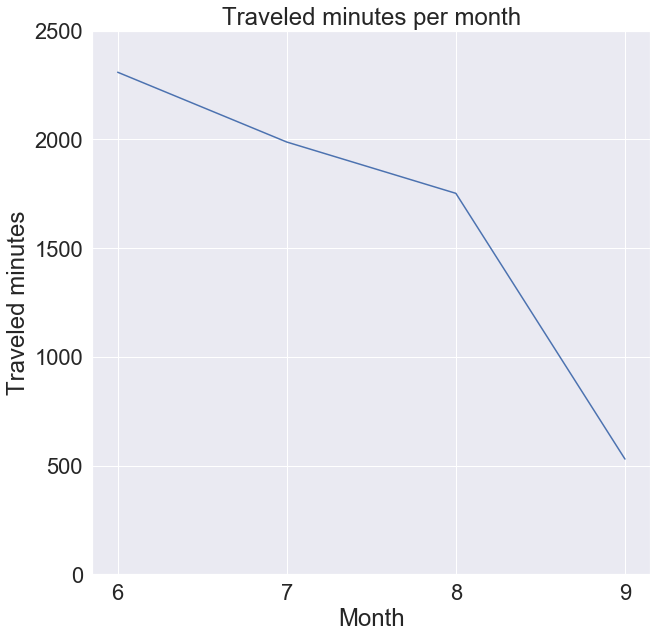
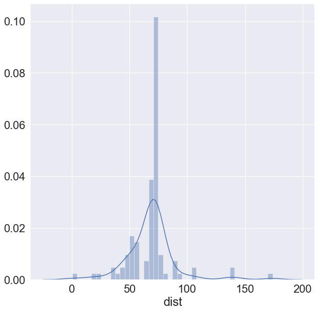

# Descriptive Statistics and Visualization

For the examples in this note I will use the following DataFrame (which is the same as on the slides)>

```python
import pandas as pd

df = pd.DataFrame()
df['Friend'] = ['Andrew', 'Bernhard', 'Carolina', 'Dennis', 'Eve', 'Fred', 'Gwyneth', 'Hayden', 'Irene', 'James', 'Kevin', 'Lea',
'Marcus', 'Nigel']
df['Weight'] = [77,110,70,85,65,75,75,63,55,66,95,72,83,115]
df['Height'] = [175,195,172,180,168,173,180,165,158,163,190,172,185,192]
```


### **Descriptive Univariate Analysis**

> All of the statistic metrics covered in the lecture could be calculated manually using DataFrame's groupby and apply methods and maybe some for cycles. This approach is good for practice, however pandas has most of these statistic metrics built-in. I will use the built-in methods show possible. 

Let's calculate the frequencies for height. 

First we do a group by based on height, then we calculate each column one by one>

```python
dua = pd.DataFrame()
grouped = df.groupby('Height').count()
dua['Height'] = grouped.index.values
dua['Absolute Frequency'] = grouped['Friend'].values
dua['Relative Frequency'] = dua['Absolute Frequency'].apply(lambda x: x / dua['Absolute Frequency'].sum() * 100)
dua['Absolute Cumulative Frequency'] = dua['Absolute Frequency'].cumsum()
#dua['Relative Cumulative Frequency'] = dua['Relative Frequency'].cumsum()# This could cause some rounding errors!
dua['Relative Cumulative Frequency'] = dua['Absolute Cumulative Frequency'].apply(lambda x: x / dua['Absolute Frequency'].sum() * 100)
```


### **Visualization**

For visualization in python we use matplotlib. See the [gallery](https://matplotlib.org/gallery.html) to get an overview of it's capabilities. 

Another great library is Seaborn. It is built on top of matplotlib. See the [gallery](https://seaborn.pydata.org/examples/index.html) for it's capabilities.


First import the necessary libraries and the data from [practice 1](practice_1.md)>

```python
import matplotlib.pyplot as plt
import seaborn as sns
%matplotlib inline # This tells jupyter notebook to render the images


df = pd.read_csv('practice/fuel_data.txt', delimiter='\t')
sns.set(font_scale=2) # Sets the font bigger

# The below command have to be inserted in each cell to modify the rendered figures of that cell
plt.figure(figsize = (10,10)) # Sets the rendered figure bigger
```

**Pie Chart**

Pie charts are not implemented in seaborn, so for this one we have to rely on the somewhat lower level matplotlib api.

Let's see the ratio of air conditioned travels>

```python
grouped_by_ac = df.groupby('air conditioner').count()
plt.figure(figsize = (10,10))
plt.pie(grouped_by_ac['date'].values, labels=grouped_by_ac.index.values, autopct='%1.1f%%')
plt.title('Ratio of air conditioned travels')
```


**Bar chart**


Let's see the same thing using a bar plot and Seaborn>

```python
plt.figure(figsize = (10,10))
ax = sns.barplot(x=grouped_by_ac.index.values, y=grouped_by_ac['date'].values)
ax.set(xlabel='Air conditioning status', ylabel='Ratio %', title='Ratio of air conditioned travels')
```




**Line chart**

Let's visualize the monthly sum of traveled minutes>

```python
df['duration_minutes'] = df['duration'].apply(lambda time: int(time.split(':')[0]) * 60 + int(time.split(':')[1]))
df['month'] = df['date'].apply(lambda date: int(date.split('.')[1]))
duration_sum_by_month = df.groupby('month')['duration_minutes'].sum()
months = [str(month) for month in duration_sum_by_month.index.values] # Forcing seaborn to treat these as strings, try commenting this line :)

plt.figure(figsize = (10,10))
ax = sns.lineplot(x=months, y=duration_sum_by_month.values)
ax.set(xlabel='Month', ylabel='Traveled minutes', title='Traveled minutes per month')
ax.set(ylim=(0, 2500)) # Sets the scale on the Y axis
```


**Scatter chart** 

Let's visualize the relation between the travel time and the traveled distance> 

```python
plt.figure(figsize = (10,10))
sns.scatterplot(data=df, x='duration_minutes', y='dist', hue='road', style='road')
# note the data parameter! We can pass a dataframe directly and thus the x, y parameters can refer to the column of the passed dataframe. 
```


**Histogram**


Let's display a histogram about the distribution of travels by travel distance>

```python
plt.figure(figsize = (10,10))
sns.distplot(df["dist"])
```




Another version is to put the travel distances in a range>

```python
import numpy as np
distance_distribution = df.groupby(pd.cut(df["dist"], np.arange(0, df['dist'].max() + 10, 10))).count()

plt.figure(figsize = (15,15))

ax = sns.barplot(x=distance_distribution.index.values, y=distance_distribution['date'], color='cyan')
ax.set_xticklabels(ax.get_xticklabels(), rotation=90)
ax.set(xlabel='Traveled distance range', ylabel='Number of travels in given range', title='Travel range distribution')
```


**Export**

Saving figures>

```python
# Issue this command at any cell where you created a plot 
plt.savefig('figure.png')
```

#### Excercise

These exercises rely on the fuel data from [practice 1](practice_1.md). 

1. Show the absolute frequencies of road types on a Pie Chart!

2. Show the absolute frequency polygon (line chart) for average consumption!


3. Visualize the relative cumulative frequency of average consumption using a Bar chart!

3. Create a histogram of the average consumption by compressing the values into .5 width ranges! (Group the consumption values into ranges like [4-4.5[, [4.5-5[ etc.)

5. Create a scatterplot showing the correlation between the distance and duration for each road type!

4. Calculate the total consumption based on the average consumption and the distance! Visualize the correlation between the consumption, distance and fuel type using a scatter plot. 
