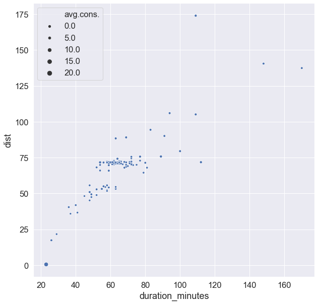
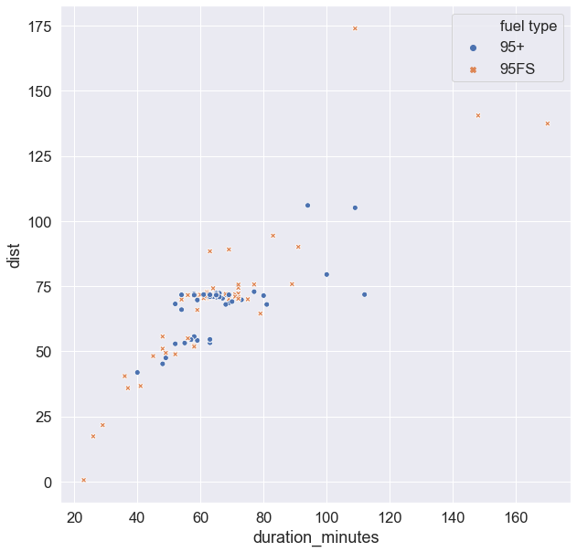
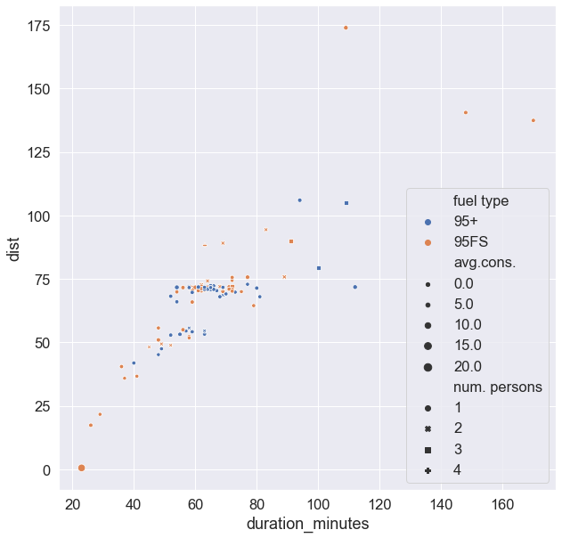
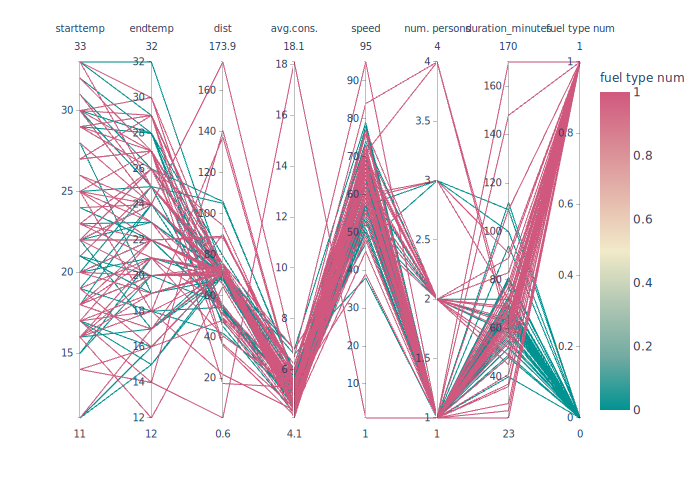
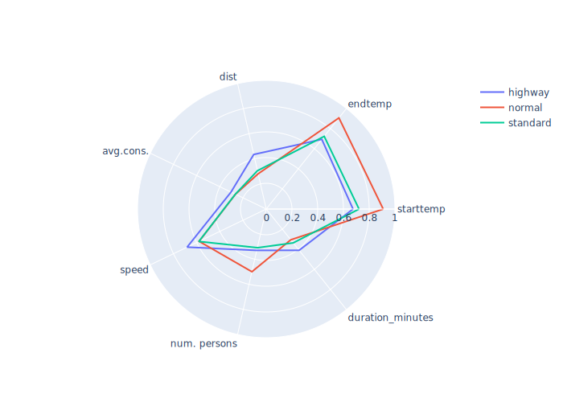
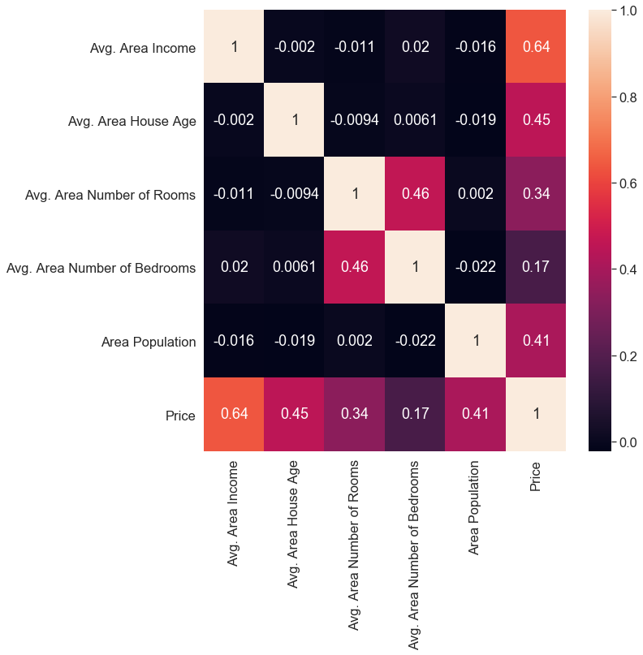
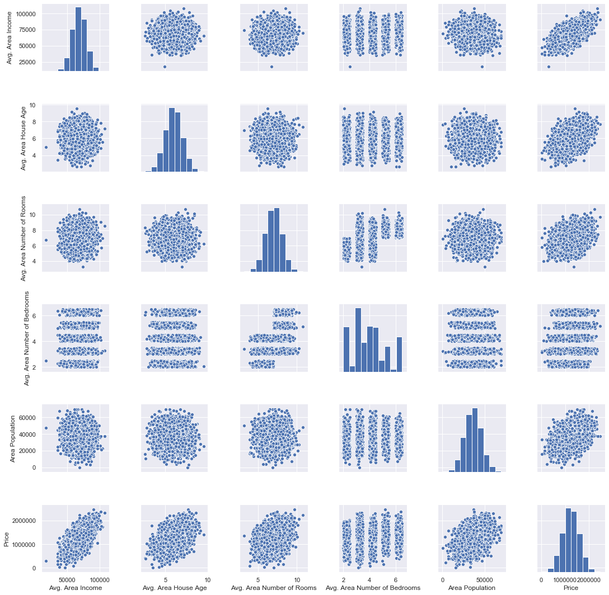
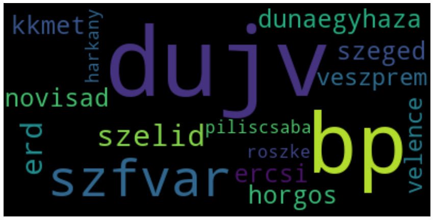

# Descriptive Multivariate Analysis

For the examples here I will use the USA housing prices dataset. [Download link](https://www.kaggle.com/vedavyasv/usa-housing/download)

For some visualizations we will use the fuel data from the previous practicals.

Load the data>

```python
import matplotlib.pyplot as plt
import seaborn as sns
import pandas as pd
%matplotlib inline

df = pd.read_csv('practice/USA_Housing.csv')
df.head()

fuel_df = pd.read_csv('practice/fuel_data.txt', delimiter='\t')
# This option will get rid of the scientific notation
#pd.set_option('display.float_format', lambda x: '%.3f' % x)
```

### **Location statistics**

Location statistics are given by *describe* method of the DataFrame type>

```python
df.describe()
```

For datasets where applicable we can get the mode. For example in the fuel data we have duplicate values in a lot of columns. Mode for fuel data>

```python
fuel_df.mode()
```

### **Dispersion statistics**


Mean Absolute Deviation>

```python
df.mad()
```

Standard Deviation>

```python
df.std()
```

Interquantile Range for a single column>

```python
speed_iqr = fuel_df['speed'].quantile(.75) - fuel_df['speed'].quantile(.25)
```

Amplitude for a single column>

```python
amplitude = df['Price'].max() - df['Price'].min()
amplitude
```

Covariance Matrix>

```python
df.cov()
```

Correlation Matrix>

```python
df.corr()# Default is 'pearson'
df.corr(method='spearman')
```

### **Visualization of increased dimensionality**

First of all let's set the default figure size in jupyter notebook>

```python
from IPython.core.pylabtools import figsize
figsize(10, 10)
```

We can increase the dimensionality with a lot of tricks. Below I represent a few of these. 

**Add quantitative dimension** by changing the size of data points based on an attribute>

```python
fuel_df['duration_minutes'] = fuel_df['duration']
              .apply(lambda time: int(time.split(':')[0]) * 60 + int(time.split(':')[1]))

sns.scatterplot(x='duration_minutes', y='dist', size='avg.cons.', data=fuel_df)
```




**Add qualitative dimension** by changing the colour and shape of data points>

```python
sns.scatterplot(x='duration_minutes', y='dist', hue='fuel type', style='fuel type', data=fuel_df)
```





Combine the previous approaches to express 5 dimension on a 2d image>

```python
sns.scatterplot(x='duration_minutes', y='dist', hue='fuel type', 
                size='avg.cons.', style='num. persons', data=fuel_df)
```




**Parallel Coordinates** example>

```python
import plotly.express as px

# We need to map the classifier to integer so that the color mapping can work on it
fuel_df['fuel type num'] = fuel_df['fuel type'].map({'95+': 0, '95FS': 1})

fig = px.parallel_coordinates(fuel_df, color="fuel type num", 
                             color_continuous_scale=px.colors.diverging.Tealrose,
                             color_continuous_midpoint=.5)
fig.show()
```

*See more shiny examples at https://plot.ly/python/parallel-coordinates-plot/*




**Radar Chart** example>

```python
import plotly.graph_objects as go
import numpy as np

# Need to normalize columns first as this API doesn't support scaling for each column..
quantitative_fuel_df = fuel_df[['starttemp', 'endtemp', 'dist', 'avg.cons.', 'speed', 'num. persons', 'duration_minutes']]
normalized_fuel_df=quantitative_fuel_df.apply(lambda x: x/x.max(), axis=0)
normalized_fuel_df['road'] = fuel_df['road']

grouped = normalized_fuel_df.groupby('road').mean()

fig = go.Figure()

# Getting each row of the grouped dataframe as a key-value dictionary and adding them to the plot one-by-one. Note that in order to get a nice closed shape we must add the first column to the end of the list. 
for row in grouped.iterrows():
    
    fig.add_trace(go.Scatterpolar(
        r=np.append(row[1].values, row[1].values[0]),
        theta=grouped.columns.tolist() + [grouped.columns[0]],
        name=row[0],
        mode = 'lines',
        connectgaps=True
    ))

fig.update_layout(
  polar=dict(
    radialaxis=dict(
      visible=True,
      range=[0, 1]
    )),
  showlegend=True,
)

fig.show()
```

*See more shiny examples at https://plot.ly/python/radar-chart/*

*Note: Because of the normalization necessary for the lack of different scale support in this radar chart API, our radar chart can only express trade-offs and trends in the data. With normalization we lose the ability of presenting the actual values.*




**Correlation heatmap** example>

```python
sns.heatmap(df.corr(), annot=True)
```




**Pairwise plot** of DataFrame>

```python
sns.set(font_scale=1.2)
plt.figure(figsize = (15,15))
sns.pairplot(fuel_df, kind="reg", hue='road')
```




**Wordcloud** example>

```python
from wordcloud import WordCloud

wordcloud = WordCloud().generate(' '.join(fuel_df['route']))

plt.imshow(wordcloud, interpolation='bilinear')
plt.axis("off")
```

*See more shiny examples at http://amueller.github.io/word_cloud/auto_examples/index.html*




### **Excercise**

1. Create a wordcloud of the House Addresses!

2. Create the pairplot for the US Housing prices dataset! Observe the plot  and try to make assumptions about the data!

3. Create the correlation heatmap for the Fuel dataset! Observe the heatmap and try to make assumptions about the data!

4. Create the parallel coordinates chart for the fuel dataset including all quantitative variables based on the road type as the class column!

5. Create a wordcloud of the cities and towns from the USA Housing prices dataset! Hints: 
- Each row's Address attribute contains 1 or 0 city name. Rows containing FPO, APO, DPO need to be filtered. 
- The city from each row can be extracted using string split. 
- Another concern is that by default the tokens are split by white space, so 'New York' would be considered 2 seperate entities instead of 1. Use wordcloud's `regexpstring` parameter to set a different tokenizer. 
