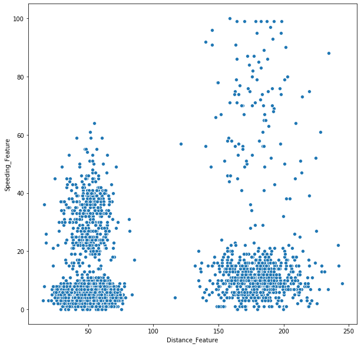
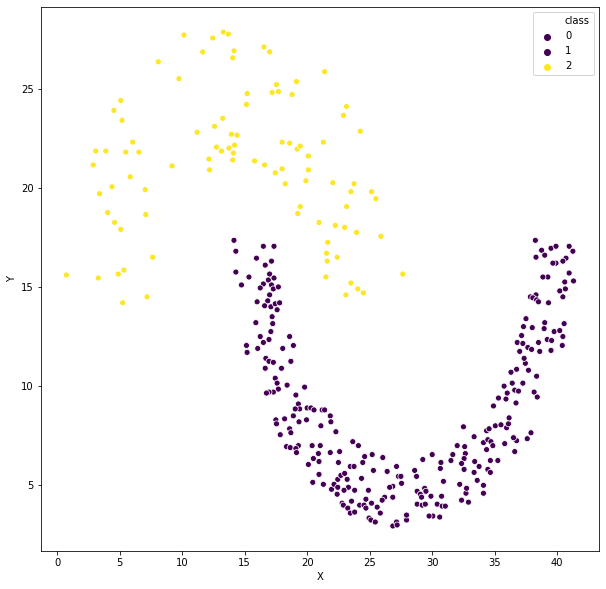
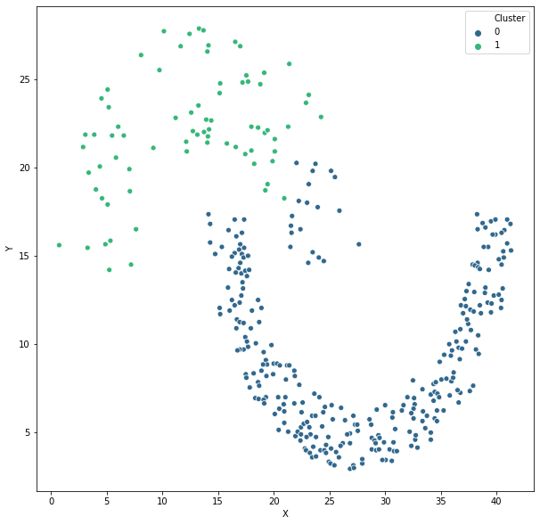
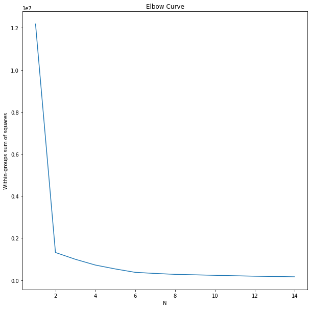

# **Clustering**

In this practical we will be using 2 new datasets for clustering. The datasets can be found in the [github repository](https://github.com/VSZM/ELTE_Adatbanyaszat_es_Gepi_tanulas/tree/master/practice). 

Let's load the datasets>

```python
import pandas as pd

simple_df = pd.read_csv('practice/data_1024.csv', delimiter='\t')
concave_df = pd.read_csv('practice/jain.txt', delimiter='\t', header=0, names = ['X', 'Y', 'class'])
```
### **Data Analysis**


Visualizing the convex dataset>

```python
import seaborn as sns
import matplotlib.pyplot as plt
%matplotlib inline
from IPython.core.pylabtools import figsize

figsize(15, 15)

sns.scatterplot(data=simple_df, x='Distance_Feature', y='Speeding_Feature')
```




We can intuitively see, that 2 or 4 clusters make sense. 


Visualizing the concave dataset. Note that for this dataset we have the designated class labels.>


```python
sns.scatterplot(data=concave_df, x='X', y='Y', hue='class', palette='viridis')
```



This one seems hard. The problem is that the two clusters have very different densities. 

### **Clustering Algorithms**

The most popular clustering algorithms are all defined in Scikit Learn. Take a look at the API for a [comparative gallery](https://scikit-learn.org/stable/modules/clustering.html). We will be using this on our course. 


Let's use the **Kmeans clustering** algorithm on the convex dataset>

```python
from sklearn.cluster import KMeans

kmeans = KMeans(n_clusters=4)
kmeans.fit(simple_df[['Distance_Feature', 'Speeding_Feature']])

simple_df['Cluster'] = kmeans.labels_
simple_df

sns.scatterplot(data=simple_df, x='Distance_Feature', y='Speeding_Feature', hue='Cluster', palette='viridis')
```


Let's use the **DBScan** on the nonconvex dataset>

```python
from sklearn.cluster import DBSCAN

dbscan = DBSCAN(eps=2.5, min_samples=4)
dbscan.fit(concave_df[['X', 'Y']])

concave_df['Cluster'] = dbscan.labels_

sns.scatterplot(data=concave_df, x='X', y='Y', hue='Cluster', palette='viridis')
```


*Note: As we can see the dbscan could not find the 2 classes. We may need to adjust the parameters or use an even more sophisticated algorithm.*

Let's use the **Agglomerative Hierarchical Clustering** on the non-convex dataset>

```python
from sklearn.cluster import AgglomerativeClustering

agglomerative = AgglomerativeClustering(n_clusters=2, linkage='complete', affinity='l2')
agglomerative.fit(concave_df[['X', 'Y']])


concave_df['Cluster'] = agglomerative.labels_
sns.scatterplot(data=concave_df, x='X', y='Y', hue='Cluster', palette='viridis')
```




### **Clustering Evaluation**

We need to have some metrics to evaluate our clustering models. 

The first one is Within-groups sum of squares. The KMeans model contains this metric as an attribute, so we do not need to calculate it. The name of the attribute is `inertia_`. Using this attribute we can easily draw the Elbow Curve of KMeans over our dataset using a range of Ns>

```python
error_rates = []
Ns = []

for N in range(1,15):
    kmeans = KMeans(n_clusters=N).fit(simple_df[['Distance_Feature', 'Speeding_Feature']])
    error_rates.append(kmeans.inertia_)
    Ns.append(N)
    
ax = sns.lineplot(x=Ns, y=error_rates)
ax.set(xlabel='N', ylabel='Within-groups sum of squares', title='Elbow Curve')
```



*Note: Observe that the "elbow" is bent at 2*.


Another metric is **Silhouette score**. Let's see the score for the DBScan run on the non-convex dataset>

```python
from sklearn.metrics import silhouette_score

score = silhouette_score(simple_df[['Distance_Feature', 'Speeding_Feature']], simple_df['Cluster'])
```

### **Exercise**

1. Find the best parameters for DBSCAN on the convex dataset based on Within-groups sum of squares evaluation method! Visualize the clustered data!

2. Find the best parameters for DBSCAN on the convex dataset based on Silhouette score evaluation method! Visualize the clustered data!

3. Do the best parameters differ between the previous 2 exercises? What could be the reason?

4. Find a solution for the concave dataset using one of the demonstrated models in the [Scikit Learn clustering gallery](https://scikit-learn.org/stable/modules/clustering.html)! *Hint: There is a model that can easily solve it, withouth much hyperparameter tuning*