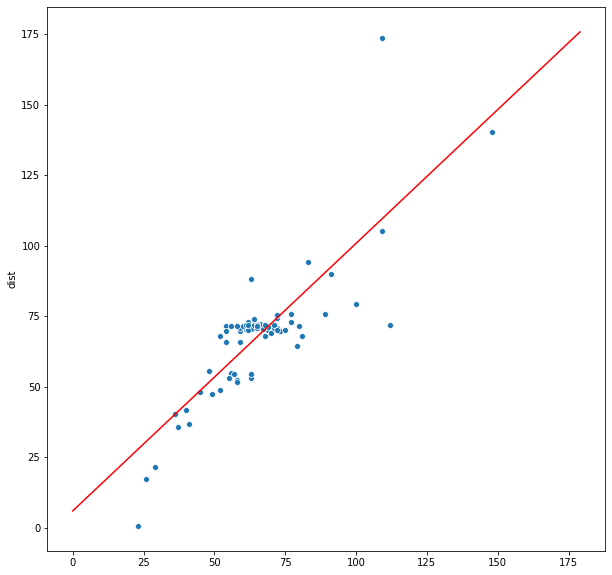
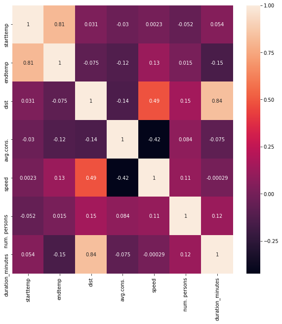

# **Regression**

In today's lesson we will be using the Fuel dataset and the house pricing dataset. Lets import the fuel data>


```python
import pandas as pd

fuel_df = pd.read_csv('practice/fuel_data.txt', delimiter='\t')
fuel_df['duration_minutes'] = fuel_df['duration']\
                                    .apply(lambda time: int(time.split(':')[0]) * 60 + int(time.split(':')[1]))

fuel_df.head()
```


<table border="1" class="dataframe">
  <thead>
    <tr style="text-align: right;">
      <th></th>
      <th>date</th>
      <th>starttime</th>
      <th>endtime</th>
      <th>starttemp</th>
      <th>endtemp</th>
      <th>air conditioner</th>
      <th>trafic</th>
      <th>route</th>
      <th>dist</th>
      <th>avg.cons.</th>
      <th>speed</th>
      <th>duration</th>
      <th>fuel type</th>
      <th>road</th>
      <th>num. persons</th>
      <th>duration_minutes</th>
    </tr>
  </thead>
  <tbody>
    <tr>
      <th>0</th>
      <td>2018.06.03</td>
      <td>00:03</td>
      <td>01:16</td>
      <td>17</td>
      <td>15</td>
      <td>off</td>
      <td>low</td>
      <td>bp-dujv</td>
      <td>69.8</td>
      <td>4.5</td>
      <td>57</td>
      <td>01:13</td>
      <td>95+</td>
      <td>standard</td>
      <td>1</td>
      <td>73</td>
    </tr>
    <tr>
      <th>1</th>
      <td>2018.06.03</td>
      <td>08:20</td>
      <td>09:29</td>
      <td>19</td>
      <td>24</td>
      <td>off</td>
      <td>low</td>
      <td>dujv-bp</td>
      <td>68.6</td>
      <td>4.6</td>
      <td>59</td>
      <td>01:09</td>
      <td>95+</td>
      <td>standard</td>
      <td>2</td>
      <td>69</td>
    </tr>
    <tr>
      <th>2</th>
      <td>2018.06.03</td>
      <td>13:00</td>
      <td>15:00</td>
      <td>30</td>
      <td>28</td>
      <td>on</td>
      <td>normal</td>
      <td>bp-dujv</td>
      <td>79.5</td>
      <td>6.0</td>
      <td>47</td>
      <td>01:40</td>
      <td>95+</td>
      <td>standard</td>
      <td>3</td>
      <td>100</td>
    </tr>
    <tr>
      <th>3</th>
      <td>2018.06.04</td>
      <td>15:30</td>
      <td>16:30</td>
      <td>29</td>
      <td>28</td>
      <td>on</td>
      <td>normal</td>
      <td>dujv-szelid</td>
      <td>45.2</td>
      <td>4.3</td>
      <td>56</td>
      <td>00:48</td>
      <td>95+</td>
      <td>standard</td>
      <td>1</td>
      <td>48</td>
    </tr>
    <tr>
      <th>4</th>
      <td>2018.06.04</td>
      <td>18:18</td>
      <td>19:10</td>
      <td>30</td>
      <td>25</td>
      <td>on</td>
      <td>normal</td>
      <td>szelid-dujv</td>
      <td>47.5</td>
      <td>4.7</td>
      <td>57</td>
      <td>00:49</td>
      <td>95+</td>
      <td>standard</td>
      <td>1</td>
      <td>49</td>
    </tr>
  </tbody>
</table>


### **Linear Regression**

We will be using Scikit Learn's implementation for linear regression. Scikit Learn has lots of linear models implemented, check them out [here](https://scikit-learn.org/stable/modules/linear_model.html). 

First let's do a simple linear model where we try to estimate the distance based on the traveled minutes. As per convention we name the matrix containing the predictor variables as X and the variable containing the target as y. 

We use simple holdout validation to measure the performance of the model. Scikit learn has a built-in method for splitting the data to train and test set and it also scrambles the data. The parameter `random_state` can be used to make the data scrambling reproducable between runs. 

This implementation of LinearRegression requires no learning rate specified. The `fit` method of the model can be used to train the model. 


```python
from sklearn.linear_model import LinearRegression
from sklearn.metrics import mean_absolute_error, mean_squared_error
from sklearn.model_selection import train_test_split

# When dealing with single predictor variables we need to reshape the vector we get into a matrix
X = fuel_df['duration_minutes'].values.reshape(-1, 1)
y = fuel_df['dist']

X_train, X_test, y_train, y_test = train_test_split(X, y, test_size = 0.2, random_state=101)

model = LinearRegression()
model.fit(X_train, y_train)


```


    LinearRegression(copy_X=True, fit_intercept=True, n_jobs=None, normalize=False)


Now that we have the model trained, let's evaluate the model using RMSE and MAE! Fortunately Scikit Learn [has us covered](https://scikit-learn.org/stable/modules/model_evaluation.html#regression-metrics) here as well. 

The `predict` method of the model can be used to predict new values. 


```python
from math import sqrt

y_pred = model.predict(X_test)
sqrt(mean_squared_error(y_test, y_pred)), mean_absolute_error(y_test, y_pred)
```


    (9.796223220262323, 7.218690232923231)


**Let's visualize the model and compare it to the data points>**


```python
import numpy as np
import matplotlib.pyplot as plt
import seaborn as sns
%matplotlib inline

interval = np.arange(0, 180)
y_interval = model.predict(interval.reshape(-1, 1))

plt.figure(figsize = (10,10))
X_train_orig = [arr[0] for arr in X_train]
sns.scatterplot(x=X_train_orig, y=y_train)
plt.plot(interval, y_interval, color='r')
```





**From physics we know that `s = v * t`. So let's use the `speed` column as well to improve our model>**


```python
X = fuel_df[['duration_minutes' , 'speed']].values
y = fuel_df['dist']

X_train, X_test, y_train, y_test = train_test_split(X, y, test_size = 0.2, random_state=101)


model2 = LinearRegression()
model2.fit(X_train, y_train)

y_pred = model2.predict(X_test)
sqrt(mean_squared_error(y_test, y_pred)), mean_absolute_error(y_test, y_pred)
```


    (3.5233798026755205, 1.9306478799891345)


**Let's see if there are any other highly correlated attributes we could use for improving the accuracy of estimating the distance>**


```python
plt.figure(figsize = (10,10))
sns.heatmap(fuel_df.corr(), annot=True)
```





**Based on the above heatmap we can try and add `num. persons` attribute and see if that helps>**


```python
X = fuel_df[['duration_minutes' , 'speed', 'num. persons']].values
y = fuel_df['dist']

X_train, X_test, y_train, y_test = train_test_split(X, y, test_size = 0.2, random_state=101)


model3 = LinearRegression()
model3.fit(X_train, y_train)

y_pred = model3.predict(X_test)
sqrt(mean_squared_error(y_test, y_pred)), mean_absolute_error(y_test, y_pred)
```


    (3.5568743208171587, 1.8882608534949348)


### **Exercise**

1. Try and predict the Price attribute of the House Pricing dataset! 
2. Try to improve the accuracy of the model from the previous exercise by normalizing the predictor attributes first!
3. Try to improve the accuracy of Price predictions by doing a Principal Component Analysis on the predictor attributes and create a model based on the first 2 principal components! What happens if you take even more principal components as predictors?
4. Predict endtemp on fuel dataset!
