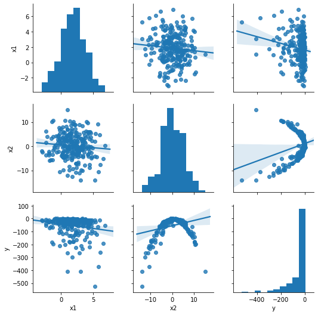
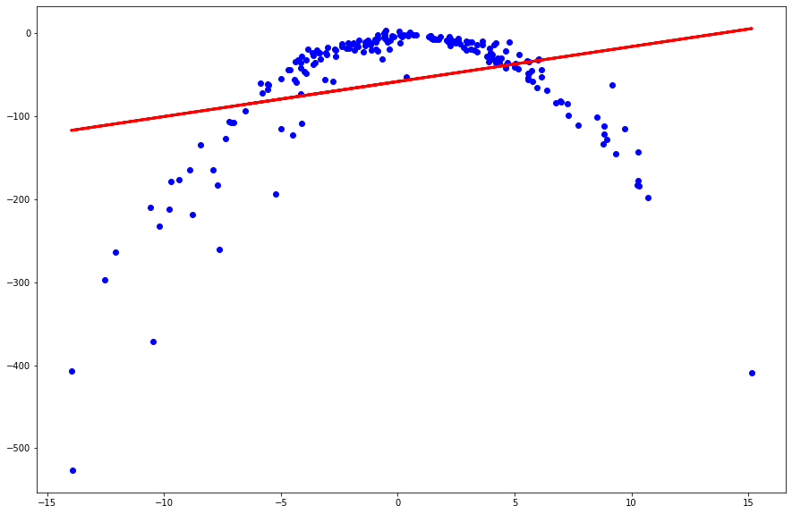
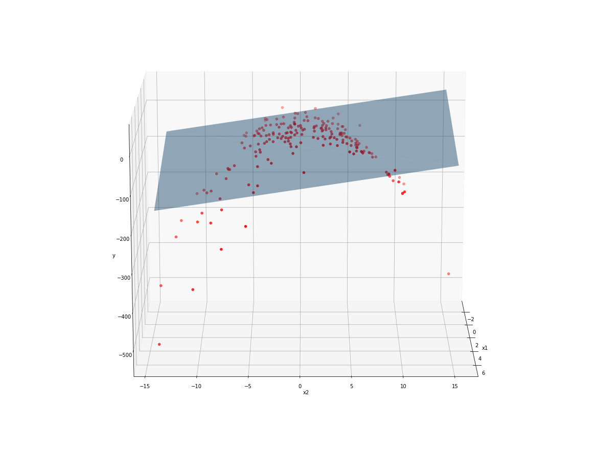
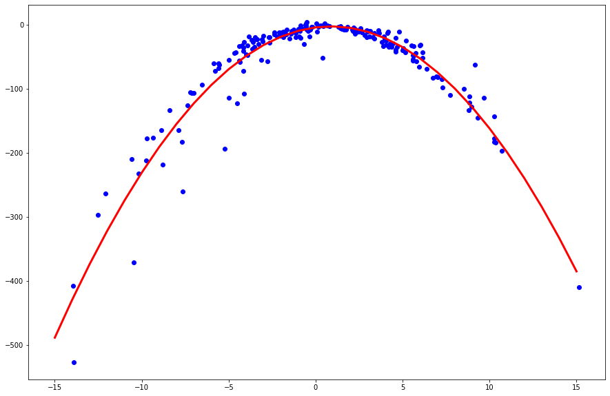
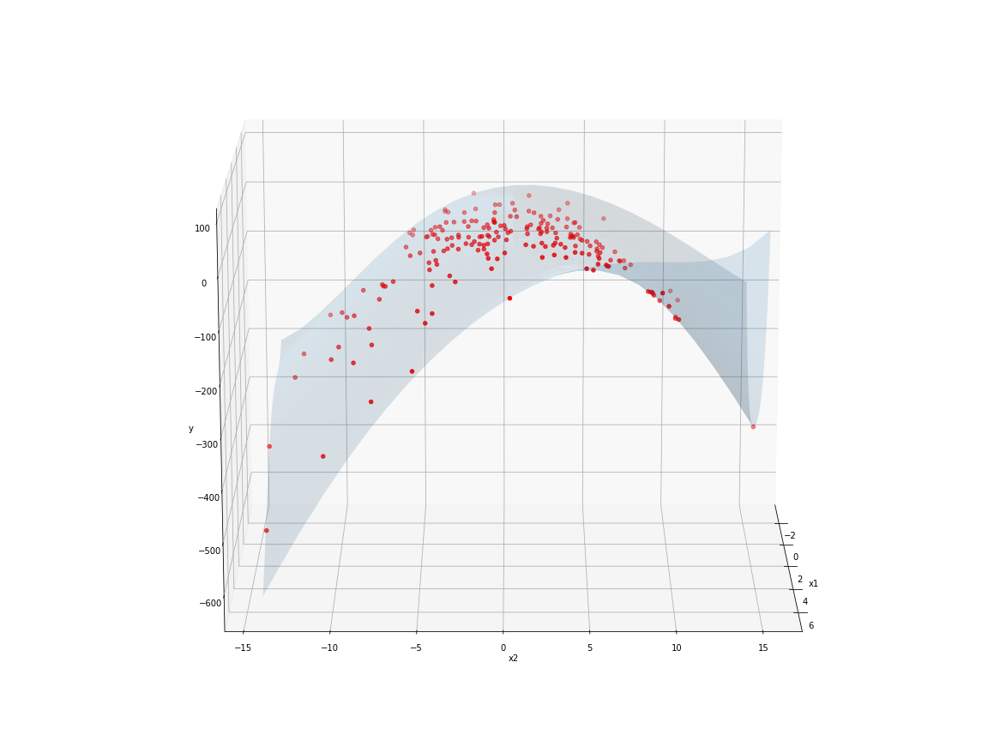

# Regression Part 2

Today we will look at what to do when the relation between the target and the predictors is not linear. For this we will use a synthetic dataset. Lets load the data and see what it looks like>


```python
import pandas as pd
import seaborn as sns
import matplotlib.pyplot as plt
import numpy as np

np.set_printoptions(suppress=True)
pd.set_option('display.float_format', lambda x: '%.5f' % x ) 

df = pd.read_csv('practice/multivar_poly_synth.csv')
df.head()
```


<div>
<table border="1" class="dataframe">
  <thead>
    <tr style="text-align: right;">
      <th></th>
      <th>x1</th>
      <th>x2</th>
      <th>y</th>
    </tr>
  </thead>
  <tbody>
    <tr>
      <th>0</th>
      <td>-1.24869</td>
      <td>-1.72494</td>
      <td>-14.70222</td>
    </tr>
    <tr>
      <th>1</th>
      <td>3.22351</td>
      <td>-1.15420</td>
      <td>-13.45638</td>
    </tr>
    <tr>
      <th>2</th>
      <td>3.05634</td>
      <td>-13.96543</td>
      <td>-407.35140</td>
    </tr>
    <tr>
      <th>3</th>
      <td>4.14594</td>
      <td>9.68764</td>
      <td>-114.54969</td>
    </tr>
    <tr>
      <th>4</th>
      <td>0.26918</td>
      <td>1.83166</td>
      <td>-8.97082</td>
    </tr>
  </tbody>
</table>
</div>


```python
df.describe()
```


<div>
<table border="1" class="dataframe">
  <thead>
    <tr style="text-align: right;">
      <th></th>
      <th>x1</th>
      <th>x2</th>
      <th>y</th>
    </tr>
  </thead>
  <tbody>
    <tr>
      <th>count</th>
      <td>250.00000</td>
      <td>250.00000</td>
      <td>250.00000</td>
    </tr>
    <tr>
      <th>mean</th>
      <td>1.84735</td>
      <td>0.15275</td>
      <td>-54.04077</td>
    </tr>
    <tr>
      <th>std</th>
      <td>1.90793</td>
      <td>5.12507</td>
      <td>76.31689</td>
    </tr>
    <tr>
      <th>min</th>
      <td>-3.05665</td>
      <td>-13.96543</td>
      <td>-526.70219</td>
    </tr>
    <tr>
      <th>25%</th>
      <td>0.61168</td>
      <td>-3.26172</td>
      <td>-58.19205</td>
    </tr>
    <tr>
      <th>50%</th>
      <td>1.84484</td>
      <td>-0.02292</td>
      <td>-24.40812</td>
    </tr>
    <tr>
      <th>75%</th>
      <td>3.19914</td>
      <td>3.86383</td>
      <td>-10.65910</td>
    </tr>
    <tr>
      <th>max</th>
      <td>6.86968</td>
      <td>15.15429</td>
      <td>4.01796</td>
    </tr>
  </tbody>
</table>
</div>


**We can use the [pairplot](https://seaborn.pydata.org/generated/seaborn.pairplot.html) from seaborn to see the relation between our target and predictors>**


```python
plt.figure(figsize=(15, 15))
sns.pairplot(df, kind='reg')
```



### **Linear Regression**

**As we can see the relation is not linear. Nevertheless lets try to train a linear model as baseline. For now lets just use only one feature *x2* as predictor>**


```python
from sklearn.model_selection import train_test_split
from sklearn.linear_model import LinearRegression


X = df['x2'].values.reshape(-1, 1)
y = df['y'].values

X_train1, X_test1, y_train1, y_test1 = train_test_split(X, y, test_size = 0.2, random_state=101)


model1 = LinearRegression()

model1.fit(X_train1, y_train1)
```


    LinearRegression(copy_X=True, fit_intercept=True, n_jobs=None, normalize=False)


**Lets visualize our trained model versus the training data>**


```python
predictions_train1 = model1.predict(X_train1)

plt.figure(figsize=(15,10))
plt.scatter(X_train1, y_train1, color='blue')
plt.plot(X_train1, predictions_train1, color = 'red', linewidth=3)

plt.show()
```





**As we can see the model does not fit the training data. Lets see if we can improve the model by adding the second predictor to it>**


```python
columns = ['x1', 'x2']
X = df[columns].values

X_train2, X_test2, y_train2, y_test2 = train_test_split(X, y, test_size = 0.2, random_state=101)

model2 = LinearRegression()
model2.fit(X_train2, y_train2)
```


    LinearRegression(copy_X=True, fit_intercept=True, n_jobs=None, normalize=False)


**Lets visualize our trained model versus the training data! We need to do this in 3D as we have 2 predictors and a target. We will use matplotlib's [Axes3D](https://matplotlib.org/3.2.1/api/_as_gen/mpl_toolkits.mplot3d.axes3d.Axes3D.html) to [plot a triangular surface](https://matplotlib.org/mpl_toolkits/mplot3d/tutorial.html#tri-surface-plots)>**


```python
from mpl_toolkits.mplot3d import Axes3D

fig = plt.figure(figsize=(16,12))
plt.clf()
ax = Axes3D(fig, elev=15, azim=0)

ax.scatter(X_train2[:, 0], X_train2[:, 1], y_train2, c = 'r', marker='o')
# We plot the surface by giving xyz coordinates for as  
ax.plot_trisurf(np.array([df['x1'].min(), df['x1'].min(), df['x1'].max(), df['x1'].max()]), 
                np.array([df['x2'].min(), df['x2'].max(), df['x2'].min(), df['x2'].max()]),
                model2.predict(np.array([[df['x1'].min(), df['x2'].min()], 
                                         [df['x1'].min(), df['x2'].max()], 
                                         [df['x1'].max(), df['x2'].min()], 
                                         [df['x1'].max(), df['x2'].max()]])),
               alpha=.45)

ax.set_xlabel('x1')
ax.set_ylabel('x2')
ax.set_zlabel('y')
```


    Text(0.5, 0, 'y')





**Static 3D plots are hard to read as you can see. We can create however a gif animation where we rotate the plot>**


```python
from matplotlib.animation import FuncAnimation


# Update function that updates the plot
def update(i):
    ax.azim = i
    return ax

anim = FuncAnimation(fig, update, frames=range(361), interval=33)

anim.save('3d_linear_regression_plot.gif', dpi=80, writer='imagemagick')
```


### **Polynomial Regression**

**Let's try to use Polynomial regression using the _x2_ predictory only. We will assume the original model is a quadratic equation. We can use Scikit Learn's [PolynomialFeatures](https://scikit-learn.org/stable/modules/generated/sklearn.preprocessing.PolynomialFeatures.html) class to extend our data with polynomial attributes.>**


```python
from sklearn.preprocessing import PolynomialFeatures

X = df['x2'].values.reshape(-1, 1)
poly = PolynomialFeatures(degree=2)

X_train3o, X_test3o, y_train3, y_test3 = train_test_split(X, y, test_size = 0.2, random_state=101)
X_train3 = poly.fit_transform(X_train3o)
X_test3 = poly.fit_transform(X_test3o)

model3 = LinearRegression()
model3.fit(X_train3, y_train3)
```


    LinearRegression(copy_X=True, fit_intercept=True, n_jobs=None, normalize=False)


**Lets visualize our trained model versus the training data>**


```python
sequence = np.array(range(-15, 16)).reshape(-1, 1)
poly_sequence = poly.fit_transform(sequence)
predictions_sequence = model3.predict(poly_sequence)

plt.figure(figsize=(15,10))
plt.scatter(X_train3o, y_train3, color='blue')
plt.plot(sequence, predictions_sequence, color='red', linewidth=3)

plt.show()
```





**As we can see the model fits our training data very well.**


**Finally we can use both of our predictor variables to create a model>**


```python
from sklearn.preprocessing import PolynomialFeatures


X = df[columns].values
poly = PolynomialFeatures(degree=6)

X_train4o, X_test4o, y_train4, y_test4 = train_test_split(X, y, test_size = 0.2, random_state=101)
X_train4 = poly.fit_transform(X_train4o)
X_test4 = poly.fit_transform(X_test4o)

model4 = LinearRegression()
model4.fit(X_train4, y_train4)
```


    LinearRegression(copy_X=True, fit_intercept=True, n_jobs=None, normalize=False)


**We can use the *intercept_* attribute of the trained model to see where the model is intersecting the y axes. We can also see the model's parameters using the *coef_* attribute>**


```python
print(model4.intercept_)
print(model4.coef_)
```

    -487930671.3706183
    [ 4.87930669e+08 -3.23965302e-01 -2.51286227e-01 -6.87850594e-01
      2.89171232e-01 -1.75291677e+00  2.09252071e-01  4.25555339e-01
      9.33576437e-02 -1.54414898e-02  3.49841233e-02 -5.10077331e-02
      2.07289618e-02  1.21408451e-02 -8.80410029e-04 -4.16579631e-02
      6.57358067e-03 -6.30980923e-03 -9.35126646e-04 -1.09994556e-03
      1.24734555e-04  4.44709208e-03 -9.89355180e-05  6.13591849e-04
      1.40875022e-04 -6.17350970e-06 -9.99085110e-05  5.49674885e-06]
    

**As we can see model4 has a very big coefficient. This could be handled with regularization methods like Ridge and Lasso regression>**


```python
from sklearn.linear_model import Ridge, Lasso

model5 = Ridge(alpha=0.0001)
model5.fit(X_train4, y_train4)

model6 = Lasso(alpha=0.0001, max_iter=100000)
model6.fit(X_train4, y_train4)

print(model5.intercept_)
print(model5.coef_)
print(model6.intercept_)
print(model6.coef_)
```
    -1.1844932841350655
    [ 0.         -0.35723604 -0.25116434 -0.67733905  0.28478714 -1.76168284
      0.20812264  0.43034676  0.07453378  0.00896638  0.03578931 -0.0380665
      0.00008752 -0.00603825 -0.00126446 -0.03371701  0.00369304 -0.00866729
      0.00040626 -0.00042019 -0.00005675  0.00328443  0.00016482  0.00117806
      0.00002103  0.00009142  0.00002558  0.00000596]
    -1.185639074733956
    [ 0.         -0.35629925 -0.25104922 -0.67664378  0.28465571 -1.76165555
      0.20777527  0.4303625   0.07450209  0.00896474  0.03574523 -0.03804599
      0.00008309 -0.00603752 -0.00126449 -0.03368783  0.00368725 -0.00866226
      0.000406   -0.00042001 -0.00005674  0.00328182  0.00016522  0.00117744
      0.00002106  0.00009139  0.00002558  0.00000596]


**As we can see these coefficients are a lot smaller. Lets evaluate our models and compare them>**


```python
from sklearn.metrics import mean_squared_error

print(f'MSE for model1 (Linear, x2): {mean_squared_error(model1.predict(X_test1),y_test1)}')
print(f'MSE for model2 (Linear, x1 + x2): {mean_squared_error(model2.predict(X_test2),y_test2)}')
print(f'MSE for model3 (Polynomial, degree 2, x2): {mean_squared_error(model3.predict(X_test3),y_test3)}')
print(f'MSE for model4 (Polynomial, degree 6, x1 + x2): {mean_squared_error(model4.predict(X_test4),y_test4)}')
print(f'MSE for model5 (Polynomial Ridge, degree 6, x1 + x2): {mean_squared_error(model5.predict(X_test4),y_test4)}')
print(f'MSE for model6 (Polynomial Lasso, degree 6, x1 + x2): {mean_squared_error(model6.predict(X_test4),y_test4)}')
```

    MSE for model1 (Linear, x2): 3477.413905736811
    MSE for model2 (Linear, x1 + x2): 3607.0497786374062
    MSE for model3 (Polynomial, degree 2, x2): 214.1915580683145
    MSE for model4 (Polynomial, degree 6, x1 + x2): 14.11190951799403
    MSE for model5 (Polynomial Ridge, degree 6, x1 + x2): 7.1494678962927285
    MSE for model6 (Polynomial Lasso, degree 6, x1 + x2): 7.148064134088387
    

**Analyzing the results we see a few interesting points:**
    
- **Adding x1 to the linear model actually worsened the model**
- **Creating a polynomial model using x2 only brought down the MSE by an order of magnitude**
- **The polynomial model improved greatly by adding x1 predictor**
- **Ridge and Lasso also improved the model by preventing overfitting**


**Finally lets also create a visualization of the surface of our best model, model6. To do this we need to create predictions on the entire range for *x1, x2*>**


```python
xs = []
ys = []

for x1 in np.linspace(df['x1'].min(), df['x1'].max(), 25):
    for x2 in np.linspace(df['x2'].min(), df['x2'].max(), 25):
        xs.append(x1)
        ys.append(x2)

X_surface = np.c_[xs, ys]
X_surface_poly = poly.fit_transform(X_surface)
zs = model6.predict(X_surface_poly)

fig = plt.figure(figsize=(16,12))
plt.clf()
ax = Axes3D(fig, elev=15, azim=0)

ax.scatter(X_train2[:, 0], X_train2[:, 1], y_train2, c = 'r', marker='o')
ax.plot_trisurf(xs, ys, zs, alpha=.15)
ax.set_xlabel('x1')
ax.set_ylabel('x2')
ax.set_zlabel('y')

def update(i):
    ax.azim = i
    return ax

anim = FuncAnimation(fig, update, frames=range(361), interval=33)

anim.save('3d_poly_regression_plot_model6.gif', dpi=80, writer='imagemagick')
```





### **Exercise**

1. **Find the most optimal degree hyperparameter value for model3 and model4!**
2. **Fit a polynomial model on the US House Pricing dataset to predict the price attribute! Optimize the model to minimize the MSE of the model!**
3. **Visualize model4 using a GIF animation as seen before!**

